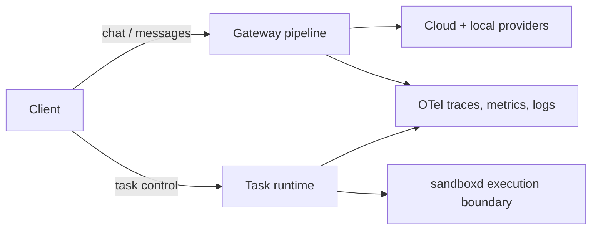

# Hecate

[](https://github.com/chicoxyzzy/hecate/actions/workflows/test.yml)
[](https://goreportcard.com/report/github.com/chicoxyzzy/hecate)
[](go.mod)
[](LICENSE)
[](https://opentelemetry.io/)

Hecate is an open-source AI gateway and agent-task runtime that gives teams one operational control plane across cloud and local models, with built-in policy, spend controls, and first-class OpenTelemetry.

One deployment serves both **model access** (OpenAI- and Anthropic-shaped traffic) and **agent-style execution loops** (queued tasks with approvals, sandboxed shell/file/git, resumable runs), while keeping operators in control of cost, safety, and traceability.

## Table Of Contents

- [Quick Start](#quick-start)
- [Architecture](#architecture)
- [Operator UI](#operator-ui)
- [Auth, Policy, And Spend](#auth-policy-and-spend)
- [Observability](#observability)
- [Using Hecate With Codex And Claude Code](#using-hecate-with-codex-and-claude-code)
- [Config Highlights](#config-highlights)
- [Commands](#commands)
- [Docs](#docs)
- [Roadmap](#roadmap)

## Quick Start

The fastest way to see what Hecate does is to boot the Docker image and step through the first-run wizard.

### Option A — Docker (zero toolchain prerequisites)

```bash
docker compose up
open http://127.0.0.1:8080
```

`docker-compose.yml` references `ghcr.io/chicoxyzzy/hecate:latest`, a multi-arch (`linux/amd64`, `linux/arm64`) image published from this repo on every `v*` tag — `docker compose pull` is enough on a fresh host. To pin to a specific release, replace `:latest` with `:vX.Y.Z`. If you've checked out the source, `docker compose up` will rebuild locally from the bundled `Dockerfile` instead.

On the first run the gateway auto-generates an admin bearer token and prints it to the container logs inside a banner like:

```
============================================================
  Hecate first-run setup — admin bearer token generated.

    7f2a91b... (truncated)

  Saved to /data/hecate.bootstrap.json (mode 0600).
============================================================
```

Open the UI in a browser. The first-run wizard walks you through pasting the token, picking a backend tier, and connecting a provider:


Copy the token from the logs (`docker compose logs hecate`) and paste it into the prompt. The browser remembers it in `localStorage`; subsequent visits go straight to the dashboard. If you've scrolled past the banner, the token also lives in the bootstrap file on the `hecate-data` volume — the gateway image is distroless, so use `docker compose cp` to copy it out without a shell:

```bash
docker compose cp hecate:/data/hecate.bootstrap.json - | tar -xO | jq -r .admin_token
```

(`docker compose cp ... -` emits a tar archive, hence the `tar -xO`.)

Once you're in, configure providers from the Providers tab — or pre-seed them with a `.env` file before `docker compose up` (the compose stack picks it up automatically). See [`docs/providers.md`](docs/providers.md) for the full provider catalog and configuration options.

Optional services live behind profiles:

```bash
docker compose --profile postgres up    # adds Postgres for state persistence
docker compose --profile ollama up      # adds Ollama on :11434 for local models
docker compose --profile full up        # everything
```

To wipe the stack back to first-run (removes the `hecate-data`, `postgres-data`, and `ollama-models` volumes; regenerates the admin token on the next `docker compose up`):

```bash
make reset-docker
```

The next page load detects the rejected stale token and re-prompts for the regenerated one — no manual `localStorage` cleanup needed.

### Option B — Local build (Go + Bun)

1. Copy env defaults and configure at least one provider:

```bash
cp .env.example .env
# Edit .env — at minimum set GATEWAY_DEFAULT_MODEL plus a PROVIDER_*_API_KEY
```

2. Build the hecate binary with the UI bundled in (single binary, single port):

```bash
make ui-install
make build
make serve
```

The gateway and the operator UI are both served from `http://127.0.0.1:8080`. `make serve` stops any earlier `./hecate` process still bound to that port before starting, so re-running it is always safe.

On first run, the same admin-bearer banner is printed to stderr, and the bootstrap file is persisted at `.data/hecate.bootstrap.json` (mode 0600). Read the token back at any time:

```bash
jq -r .admin_token .data/hecate.bootstrap.json
```

For live UI iteration with hot reload, run the gateway and the Vite dev server side by side:

```bash
make dev          # gateway on :8080
make ui-dev       # Vite on :5173, proxying API calls to :8080
```

Default addresses:

- gateway + bundled UI (production): `http://127.0.0.1:8080`
- Vite dev server (UI hot reload): `http://127.0.0.1:5173`

To wipe local state back to first-run (stops any gateway on :8080 and removes `.data/`):

```bash
make reset-dev
```

## Architecture

Hecate splits into two concurrent surfaces in one binary: a gateway for OpenAI- and Anthropic-shaped client traffic, and a task runtime for queued agent work. Both share auth, budgets, and observability — but the request paths are independent, so you can use either in isolation.



For the full request lifecycle, error short-circuits, lease semantics, and storage tier matrix, see [`docs/architecture.md`](docs/architecture.md).

## Operator UI

The operator UI is the same binary, served at `/`. Every dashboard view is also a thin layer over the public API, so anything you can do in the UI is scriptable.


Major surfaces:

- **Chat playground** — exercise any configured model, with runtime metadata (provider, model, route reason, cost) inline per turn. Sessions persist in the sidebar; the system-prompt editor floats above the input.
- **Providers** — credential lifecycle, enable/disable, health status, base-URL overrides.
- **Admin → Pricebook** — catalog of every cloud-provider model the gateway knows about (`priced` / `unpriced` / `deprecated`), filterable by provider and status. Per-row Import or bulk "Import all" pulls token prices from [LiteLLM](https://github.com/BerriAI/litellm) (MIT-licensed, attribution in [`NOTICE.md`](NOTICE.md)). Manually-edited rows are protected from blanket imports — operators opt in explicitly via the consent dialog's "Override manual" section.
- **Admin → Budget** — credit, top-up, reset; warning thresholds; per-tenant scope.
- **Admin → Tenants & Keys** — control-plane tenant lifecycle and API key management with allowed-providers/models scoping.
- **Admin → Integrations** — copy-paste env-var snippets for Codex, Claude Code, and curl smoke tests. The base URL is auto-filled from your browser location; pair with a key from the Keys tab.
- **Observe** — request ledger, trace inspector with route-report drilldown, OTel signal health.
- **Tasks** — task creation, run start/cancel/retry/resume, approvals, live SSE stdout/stderr.

The app shell lives in `ui/src/app`, shared console primitives live in `ui/src/features/shared`, and feature-owned styles live beside feature views.

### UI tour

<details>
<summary>Providers — credential, health, base-URL panel per preset</summary>


</details>

<details>
<summary>Admin → Pricebook — catalog with status filters and LiteLLM import</summary>


</details>

<details>
<summary>Admin → Budget — credit, top-up, warning thresholds</summary>


</details>

<details>
<summary>Admin → Tenants — control-plane tenant table with allowed-provider/model scoping</summary>


</details>

<details>
<summary>Admin → Keys — API key management with rotate / revoke flows</summary>


</details>

<details>
<summary>Admin → Integrations — copy-paste env vars for Codex, Claude Code, and curl</summary>


</details>

<details>
<summary>Observe — request ledger and trace inspector</summary>


</details>

<details>
<summary>Tasks — agent runtime workspace with approvals + live stream</summary>


</details>

## Auth, Policy, And Spend

Auth supports admin bearer (auto-generated on first run; override with `GATEWAY_AUTH_TOKEN`) and persisted control-plane API keys with allowed-providers/allowed-models scoping.

The control plane manages tenants, keys, providers (with encrypted secrets at rest), policy rules, the pricebook, and audit history.

The governor enforces budgets (with warning thresholds, top-ups, resets, and history), denies requests as `402` on budget exhaustion, and rate-limits per-key with `X-RateLimit-*` headers.

## Observability

- request IDs, trace IDs, and span IDs in response headers
- first-class OpenTelemetry traces, metrics, and logs
- structured logs
- local trace inspection over HTTP
- OTLP HTTP export for traces, metrics, and logs
- optional request/response trace body capture (`GATEWAY_TRACE_BODIES=true`)
- runtime telemetry health and SLO snapshots via `/admin/runtime/stats`

For full telemetry details, see [`docs/telemetry.md`](docs/telemetry.md).

## Using Hecate With Codex And Claude Code

Hecate supports both OpenAI-compatible clients and Anthropic Messages clients, so you can point Codex and Claude Code at one gateway:

- OpenAI-compatible path: `POST /v1/chat/completions`
- Anthropic path: `POST /v1/messages`
- Discovery: `GET /v1/models`

For copy-paste setup and auth/header examples, see [`docs/client-integration.md`](docs/client-integration.md).

## Config Highlights

The full env surface lives in `.env.example`; the table below covers the knobs operators reach for most often. Anything not listed here keeps a sensible default — see [`internal/config/config.go`](internal/config/config.go) for the authoritative list.

### Auth and data

| Variable | Default | What it does |
|---|---|---|
| `GATEWAY_AUTH_TOKEN` | auto-generated | Admin bearer token. Empty → generated on first run, persisted to the bootstrap file, printed once to stderr. |
| `GATEWAY_DATA_DIR` | `.data` (local), `/data` (docker) | Where auto-generated state goes (the bootstrap file by default). Mount a volume here in production. |
| `GATEWAY_CONTROL_PLANE_SECRET_KEY` | auto-generated | AES-GCM key for encrypted provider credentials at rest. Empty → generated and persisted. |

### Storage backends

Every store accepts `memory` (in-process, ephemeral) by default. Switch to `postgres` (or `redis` where available) for persistence across restarts.

| Variable | Accepted values |
|---|---|
| `GATEWAY_CONTROL_PLANE_BACKEND` | `memory` \| `redis` \| `postgres` |
| `GATEWAY_RETENTION_HISTORY_BACKEND` | `memory` \| `redis` \| `postgres` |
| `GATEWAY_CHAT_SESSIONS_BACKEND` | `memory` \| `postgres` |
| `GATEWAY_TASKS_BACKEND` | `memory` \| `postgres` |
| `GATEWAY_TASK_QUEUE_BACKEND` | `memory` \| `postgres` |
| `GATEWAY_CACHE_BACKEND` | `memory` \| `redis` \| `postgres` |
| `GATEWAY_SEMANTIC_CACHE_BACKEND` | `memory` \| `postgres` |
| `GATEWAY_BUDGET_BACKEND` | `memory` \| `redis` \| `postgres` |

A single `POSTGRES_DSN` and the top-level `REDIS_*` block configure the clients that any of the above can share. If any backend is set to `postgres`, `POSTGRES_DSN` must be reachable at startup or the gateway exits — there is no silent fallback to `memory`.

### Agent task runtime

| Variable | Default | What it does |
|---|---|---|
| `GATEWAY_TASK_QUEUE_WORKERS` | `1` | Concurrency: how many runs the queue dispatches in parallel. |
| `GATEWAY_TASK_QUEUE_BUFFER` | `128` | In-memory queue capacity (memory backend only). |
| `GATEWAY_TASK_QUEUE_LEASE_SECONDS` | `30` | How long a worker holds a claimed run before it can be reclaimed. |
| `GATEWAY_TASK_APPROVAL_POLICIES` | `shell_exec` | Comma-separated approval gates: `shell_exec`, `git_exec`, `file_write`, `network_egress`. |
| `GATEWAY_TASK_MAX_CONCURRENT_PER_TENANT` | `0` | Per-tenant concurrency cap. `0` = unlimited. |

### Telemetry

OpenTelemetry traces, metrics, and logs are off by default. See [`docs/telemetry.md`](docs/telemetry.md) for the full export surface (`GATEWAY_OTEL_*` env vars, samplers, OTLP recipes).

## Commands

### Build

```bash
make ui-install       # install UI dependencies (bun install)
make ui-build         # build the UI bundle into ui/dist/ (Vite)
make build            # ui-build + go build → ./hecate (single binary, UI embedded)
```

### Run

```bash
make run              # go run (no .env sourced; quick start with defaults)
make dev              # go run with .env sourced (provider keys available)
make serve            # run prebuilt ./hecate; sources .env; auto-stops a stale :8080
make ui-dev           # Vite dev server on :5173, proxies API to :8080
```

### Test

```bash
make test             # go test ./...
make test-race        # go test -race ./...
make coverage         # go test -coverprofile + writes coverage.html
make ui-test          # UI unit tests (vitest)
make ui-test-e2e      # UI end-to-end tests (Playwright)
make ui-coverage      # UI coverage report (vitest --coverage)
make test-docker-smoke # boots the production image and probes /healthz, /v1/models, bootstrap volume
```

### Reset

```bash
make reset-dev        # wipe local dev state — stops :8080, removes .data/
make reset-docker     # wipe docker stack — `docker compose --profile full down -v`
```

After either reset, the next page load detects the rejected stale token and re-prompts for the regenerated one automatically.

## Docs

- [Architecture](docs/architecture.md) — request flow, lease semantics, storage tier matrix
- [Providers](docs/providers.md) — built-in catalog, configuration, custom providers, health/circuit breaking
- [Client Integration (Codex And Claude Code)](docs/client-integration.md)
- [Runtime API Notes](docs/runtime-api.md)
- [Telemetry And OTLP Notes](docs/telemetry.md)
- [OTLP Collector Recipes And Runbooks](docs/telemetry.md#known-good-otlp-recipes)

## Roadmap

Roadmap is organized into near-term runtime priorities and platform hardening.

Near term:

1. checkpoint controls for partial replay and selective continuation
2. broader policy-driven approval classes with safer defaults
3. deeper task UI workflows for bulk operations and richer artifact/diff views

Platform:

1. clearer route diagnostics and failure explanations
2. deployment reference stacks for local and production environments

## License

MIT. See [`LICENSE`](LICENSE).

Third-party data and software notices live in [`NOTICE.md`](NOTICE.md) — most notably the LiteLLM pricing data fetched at runtime by the pricebook import feature.
