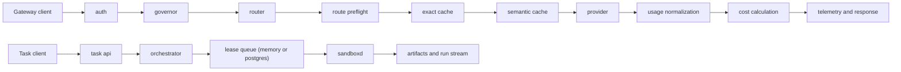
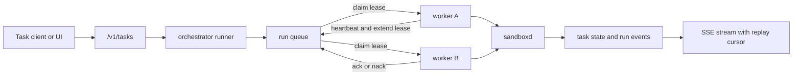

# Hecate

Hecate is an open-source AI gateway and agent runtime for teams that want one control plane across cloud and local models, with operator-grade policy, spend, and observability.

## Table Of Contents

- [What Hecate Is Today](#what-hecate-is-today)
- [Architecture](#architecture)
- [Quick Start](#quick-start)
- [Provider Model](#provider-model)
- [Auth, Policy, And Spend](#auth-policy-and-spend)
- [Observability](#observability)
- [Operator UI](#operator-ui)
- [Using Hecate For Coding](#using-hecate-for-coding)
- [Durable Queue Execution Flow](#durable-queue-execution-flow)
- [Config Highlights](#config-highlights)
- [Docs](#docs)
- [Commands](#commands)
- [Status And Roadmap](#status-and-roadmap)

## What Hecate Is Today

Hecate currently has two strong layers:

- a mature gateway/control-plane path for multi-provider model traffic
- a production-leaning coding runtime foundation for task/run execution

What already works well:

- OpenAI-compatible chat completions and Anthropic-native `/v1/messages`
- OpenAI tool-call and Anthropic tool-use compatibility behind one runtime boundary
- cloud and local provider routing with retries, failover, and health tracking
- exact and semantic cache paths
- tenant-aware auth, policies, budgets, and persisted control-plane state
- budget exhaustion (`402`) and per-API-key token-bucket rate limiting
- structured logs, trace inspection, OTLP export, and optional trace body capture
- task/run orchestration with approvals, sandboxed execution, persisted run events, and stream resume cursors
- durable leased queue backend for distributed workers via Postgres

Storage backends used across the system include `file`, `memory`, `Redis`, and `Postgres`.

## Architecture



## Quick Start

1. Copy env defaults:

```bash
cp .env.example .env
```

2. Configure at least one provider in `.env`.

`GATEWAY_PROVIDERS` is optional. Hecate can infer enabled providers from core
provider envs like `PROVIDER_<NAME>_API_KEY` and `PROVIDER_<NAME>_BASE_URL`.

Example cloud + local:

```bash
GATEWAY_PROVIDERS=openai,ollama
GATEWAY_DEFAULT_MODEL=gpt-5.4-mini
PROVIDER_OPENAI_API_KEY=your_api_key_here
```

Example cloud-only:

```bash
GATEWAY_DEFAULT_MODEL=gpt-5.4-mini
PROVIDER_OPENAI_API_KEY=your_api_key_here
```

3. Run the gateway:

```bash
make dev
```

4. Run the UI in another shell:

```bash
make ui-install
make ui-dev
```

Default addresses:

- gateway: `http://127.0.0.1:8080`
- UI: `http://127.0.0.1:5173`

## Provider Model

Hecate uses a vendor-neutral provider layer at the runtime boundary. It treats
OpenAI-compatible upstreams and Anthropic Messages API as first-class paths.

Core provider env knobs:

- `PROVIDER_<NAME>_API_KEY`
- `PROVIDER_<NAME>_BASE_URL`
- `PROVIDER_<NAME>_DEFAULT_MODEL`

Advanced overrides such as protocol, API version, and timeout are also
available when needed.

Built-in cloud presets:

- `openai`
- `anthropic`
- `groq`
- `gemini`

Built-in local presets:

- `ollama`
- `lmstudio`
- `localai`
- `llamacpp`

Default local base URLs:

- `ollama`: `http://127.0.0.1:11434/v1`
- `lmstudio`: `http://127.0.0.1:1234/v1`
- `localai`: `http://127.0.0.1:8080/v1`
- `llamacpp`: `http://127.0.0.1:8080/v1`

## Auth, Policy, And Spend

Auth supports:

- admin bearer token
- persisted API keys from the control plane

Control plane supports:

- tenant and API key management
- persisted provider management with encrypted secrets
- provider enable/disable and rotation flows
- policy and pricebook CRUD
- audit history

Spend/governor supports:

- budget accounting and enforcement
- warning thresholds, top-ups, resets, and history
- request denial as `402` on budget exhaustion
- per-key rate limiting with `X-RateLimit-*` headers

## Observability

Observability includes:

- request IDs, trace IDs, and span IDs in response headers
- structured logs
- local trace inspection over HTTP
- OTLP HTTP export for traces, metrics, and logs
- optional request/response trace body capture (`GATEWAY_TRACE_BODIES=true`)

For full telemetry details, see [`docs/telemetry.md`](docs/telemetry.md).

## Operator UI

The operator UI includes:

- provider/model visibility and setup presets
- managed provider lifecycle flows (enable/disable/delete/rotate)
- playground and runtime metadata inspection
- task creation, run starts, approvals, cancellation, and live stdout/stderr
- trace inspection
- budget admin flows
- tenant/API key management and control-plane activity views

The app shell lives in `ui/src/app`, shared console primitives live in
`ui/src/features/shared`, and feature-owned styles live beside feature views.

## Using Hecate For Coding

Hecate is already useful behind coding assistants even when orchestration logic
still lives in the client.

Current coding-runtime foundation:

- task/run/step/artifact/approval APIs
- shell, file, and git executors
- out-of-process `cmd/sandboxd`
- per-run workspace provisioning
- sandbox policy controls (roots, read-only mode, timeout, network denial)
- policy-driven approvals (`shell_exec`, `git_exec`, `file_write`, `network_egress`)
- queueing, cancellation, retry/resume APIs
- persisted run events and SSE stream resume (`after_sequence`, `Last-Event-ID`)
- durable distributed queue semantics via Postgres lease claims

## Durable Queue Execution Flow



## Config Highlights

Runtime and queue knobs commonly adjusted for coding workflows:

- `GATEWAY_TASKS_BACKEND=memory|postgres`
- `GATEWAY_TASK_QUEUE_BACKEND=memory|postgres`
- `GATEWAY_TASK_QUEUE_WORKERS=<int>`
- `GATEWAY_TASK_QUEUE_BUFFER=<int>`
- `GATEWAY_TASK_QUEUE_LEASE_SECONDS=<int>`
- `GATEWAY_TASK_APPROVAL_POLICIES=shell_exec,git_exec,file_write,network_egress`
- `GATEWAY_TASK_MAX_CONCURRENT_PER_TENANT=<int>`

Use `.env.example` as the baseline. For the full env surface, see
`internal/config/config.go`.

## Docs

- [Runtime API Notes](docs/runtime-api.md)
- [Telemetry And OTLP Notes](docs/telemetry.md)

## Commands

```bash
make dev
make test
make ui-install
make ui-dev
make ui-build
```

## Status And Roadmap

Delivered:

- gateway runtime with OpenAI + Anthropic API compatibility
- control plane with persisted policy, pricebook, and provider management
- spend governance and key-level rate limiting
- operator UI for day-to-day runtime operations
- coding runtime foundation with sandboxd, approvals, run events, stream resume
- durable leased queue backend for distributed workers

Next focus areas:

- resumable execution semantics for long-lived coding runs
- broader policy-driven approval classes
- richer coding-focused UI views and aggregate run operations
- improved route-reason taxonomy and debug ergonomics
- automated provider pricebook ingestion and sync
- deployment examples for local and production environments
