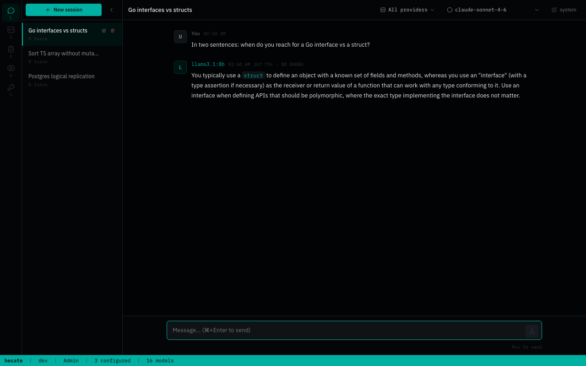
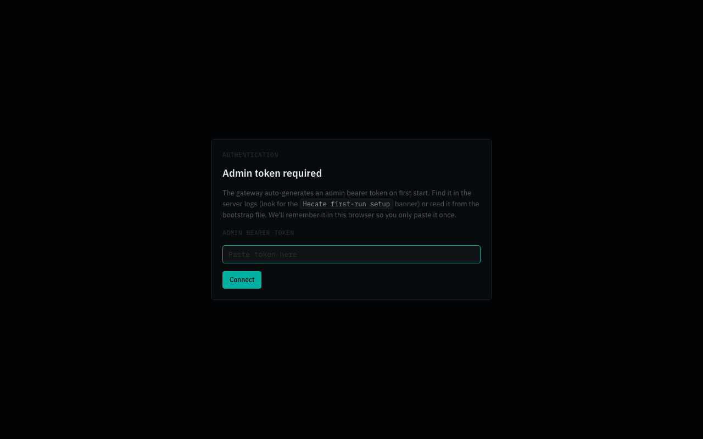
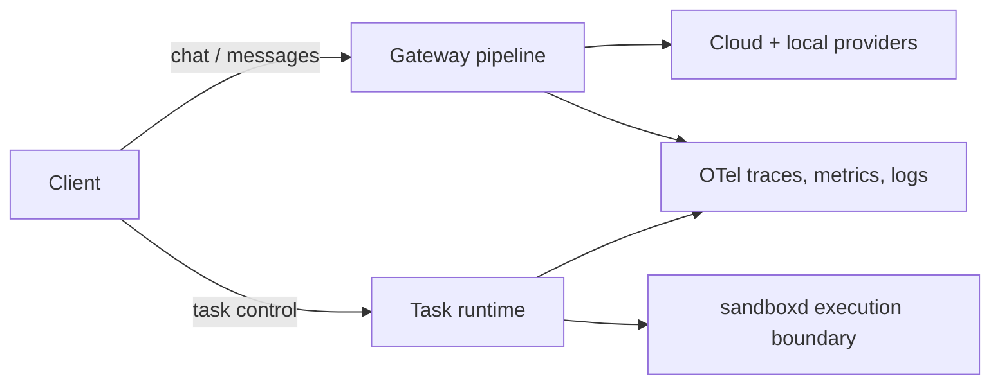
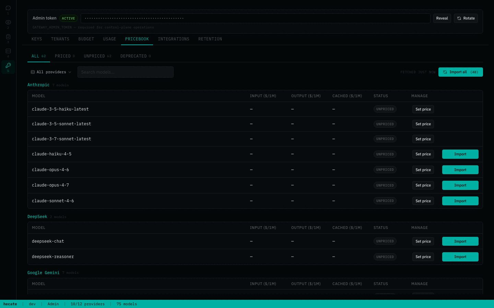
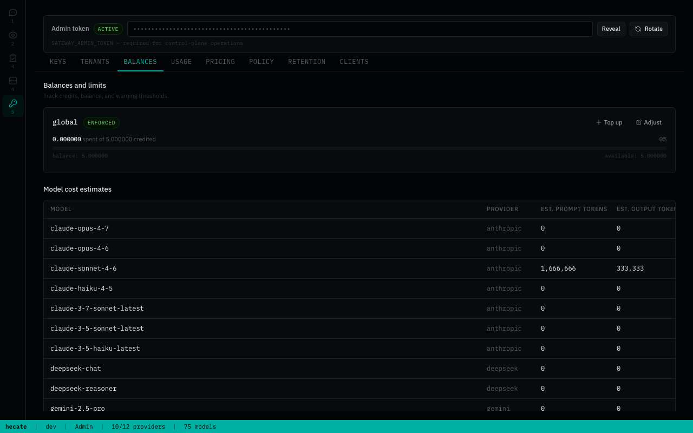
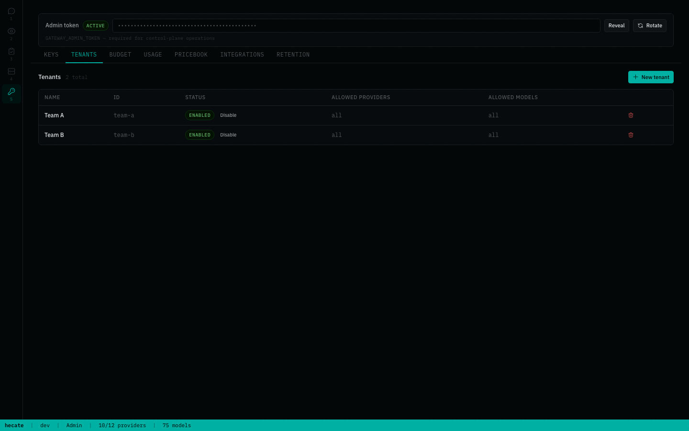
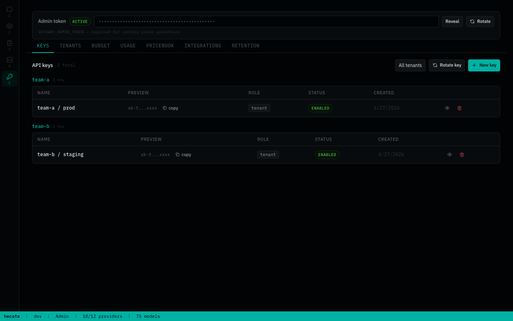
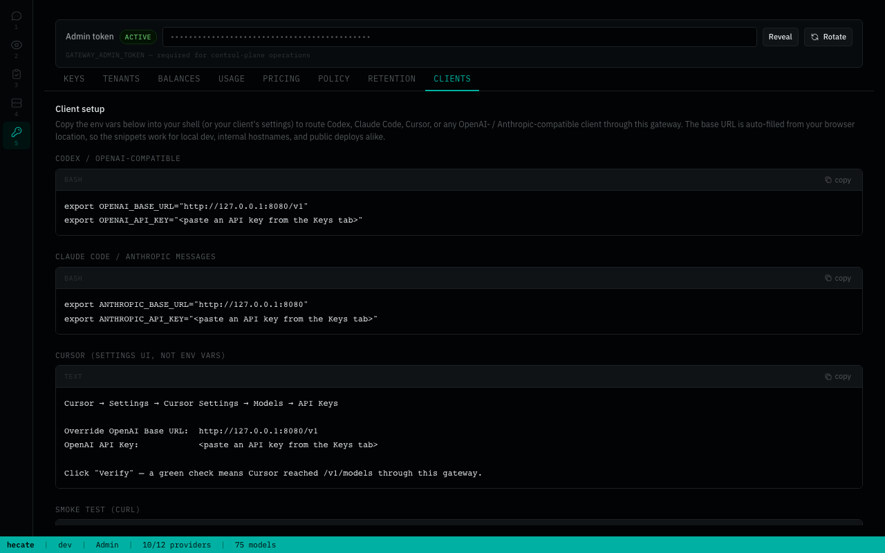
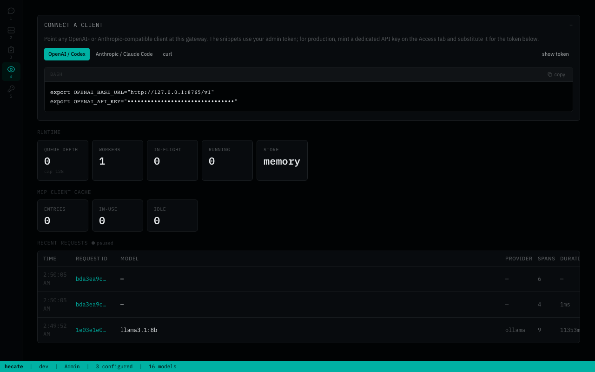
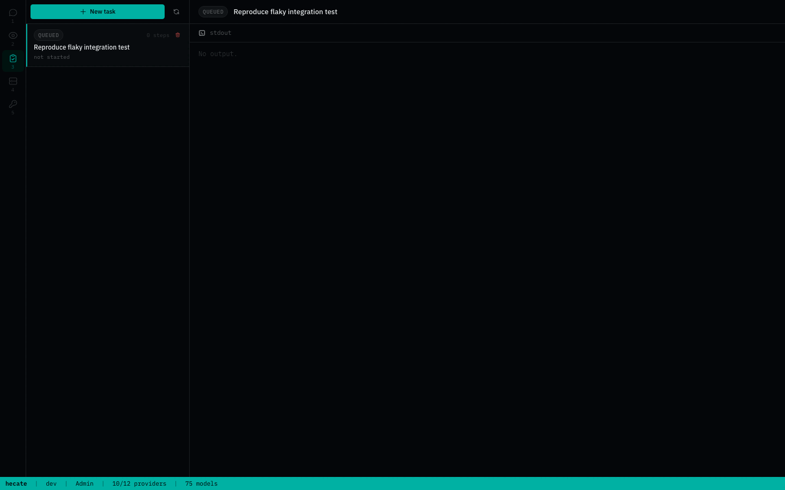

# Hecate

[](https://github.com/chicoxyzzy/hecate/actions/workflows/test.yml)
[](https://goreportcard.com/report/github.com/chicoxyzzy/hecate)
[](go.mod)
[](LICENSE)
[](https://opentelemetry.io/)

Hecate is an open-source AI gateway and agent-task runtime that gives teams one operational control plane across cloud and local models, with built-in policy, spend controls, and first-class OpenTelemetry.

One deployment serves both **model access** (OpenAI- and Anthropic-shaped traffic) and **agent-style execution loops** (queued tasks with approvals, sandboxed shell/file/git, resumable runs), while keeping operators in control of cost, safety, and traceability.



## Table Of Contents

- [Quick Start](#quick-start)
- [Architecture](#architecture)
- [Operator UI](#operator-ui)
- [Auth, Policy, And Spend](#auth-policy-and-spend)
- [Observability](#observability)
- [Using Hecate With Codex And Claude Code](#using-hecate-with-codex-and-claude-code)
- [Config Highlights](#config-highlights)
  - [Auth and data](#auth-and-data)
  - [Storage backends](#storage-backends)
  - [Agent task runtime](#agent-task-runtime)
  - [Telemetry](#telemetry)
- [Docs](#docs)
- [Roadmap](#roadmap)
- [License](#license)

## Quick Start

```bash
docker compose up
```

The gateway boots on `http://127.0.0.1:8080`, generates an admin bearer token, and prints it to the container logs inside a banner:

```
============================================================
  Hecate first-run setup — admin bearer token generated.

    7f2a91b... (truncated)

  Saved to /data/hecate.bootstrap.json (mode 0600).
============================================================
```

Open the UI, paste the token, and the first-run wizard walks you through connecting a provider:



The browser remembers the token in `localStorage`; subsequent visits go straight to the dashboard. To pre-seed providers, drop a `.env` next to `docker-compose.yml` before booting — see [`docs/providers.md`](docs/providers.md) for the catalog.

For Postgres/Ollama compose profiles, image pinning, lost-token recovery, and reset commands, see [`docs/deployment.md`](docs/deployment.md). Building from source: [`docs/development.md`](docs/development.md).

## Architecture

Hecate splits into two concurrent surfaces in one binary: a gateway for OpenAI- and Anthropic-shaped client traffic, and a task runtime for queued agent work. Both share auth, budgets, and observability — but the request paths are independent, so you can use either in isolation.



For the full request lifecycle, error short-circuits, lease semantics, and storage tier matrix, see [`docs/architecture.md`](docs/architecture.md).

## Operator UI

The operator UI is the same binary, served at `/`. Every dashboard view is also a thin layer over the public API, so anything you can do in the UI is scriptable.

Major surfaces:

- **Chat playground** — exercise any configured model, with runtime metadata (provider, model, route reason, cost) inline per turn. Sessions persist in the sidebar; the system-prompt editor floats above the input.
- **Providers** — credential lifecycle, enable/disable, health status, base-URL overrides.
- **Admin → Pricebook** — catalog of every cloud-provider model the gateway knows about (`priced` / `unpriced` / `deprecated`), filterable by provider and status. Per-row Import or bulk "Import all" pulls token prices from [LiteLLM](https://github.com/BerriAI/litellm) (MIT-licensed, attribution in [`NOTICE.md`](NOTICE.md)). Manually-edited rows are protected from blanket imports — operators opt in explicitly via the consent dialog's "Override manual" section.
- **Admin → Budget** — credit, top-up, reset; warning thresholds; per-tenant scope.
- **Admin → Tenants & Keys** — control-plane tenant lifecycle and API key management with allowed-providers/models scoping.
- **Admin → Integrations** — copy-paste env-var snippets for Codex, Claude Code, and curl smoke tests. The base URL is auto-filled from your browser location; pair with a key from the Keys tab.
- **Observe** — request ledger, trace inspector with route-report drilldown, OTel signal health.
- **Tasks** — task creation, run start/cancel/retry/resume, approvals, live SSE stdout/stderr.

The app shell lives in `ui/src/app`, shared console primitives live in `ui/src/features/shared`, and feature-owned styles live beside feature views.

### UI tour

<details>
<summary>Providers — credential, health, base-URL panel per preset</summary>


</details>

<details>
<summary>Admin → Pricebook — catalog with status filters and LiteLLM import</summary>



</details>

<details>
<summary>Admin → Budget — credit, top-up, warning thresholds</summary>



</details>

<details>
<summary>Admin → Tenants — control-plane tenant table with allowed-provider/model scoping</summary>



</details>

<details>
<summary>Admin → Keys — API key management with rotate / revoke flows</summary>



</details>

<details>
<summary>Admin → Integrations — copy-paste env vars for Codex, Claude Code, and curl</summary>



</details>

<details>
<summary>Observe — request ledger and trace inspector</summary>



</details>

<details>
<summary>Tasks — agent runtime workspace with approvals + live stream</summary>



</details>

## Auth, Policy, And Spend

Auth supports admin bearer (auto-generated on first run; override with `GATEWAY_AUTH_TOKEN`) and persisted control-plane API keys with allowed-providers/allowed-models scoping.

The control plane manages tenants, keys, providers (with encrypted secrets at rest), policy rules, the pricebook, and audit history.

The governor enforces budgets (with warning thresholds, top-ups, resets, and history), denies requests as `402` on budget exhaustion, and rate-limits per-key with `X-RateLimit-*` headers.

## Observability

- request IDs, trace IDs, and span IDs in response headers
- first-class OpenTelemetry traces, metrics, and logs
- structured logs
- local trace inspection over HTTP
- OTLP HTTP export for traces, metrics, and logs
- optional request/response trace body capture (`GATEWAY_TRACE_BODIES=true`)
- runtime telemetry health and SLO snapshots via `/admin/runtime/stats`

For full telemetry details, see [`docs/telemetry.md`](docs/telemetry.md).

## Using Hecate With Codex And Claude Code

Hecate supports both OpenAI-compatible clients and Anthropic Messages clients, so you can point Codex and Claude Code at one gateway:

- OpenAI-compatible path: `POST /v1/chat/completions`
- Anthropic path: `POST /v1/messages`
- Discovery: `GET /v1/models`

For copy-paste setup and auth/header examples, see [`docs/client-integration.md`](docs/client-integration.md).

## Config Highlights

The full env surface lives in `.env.example`; the table below covers the knobs operators reach for most often. Anything not listed here keeps a sensible default — see [`internal/config/config.go`](internal/config/config.go) for the authoritative list.

### Auth and data

| Variable | Default | What it does |
|---|---|---|
| `GATEWAY_AUTH_TOKEN` | auto-generated | Admin bearer token. Empty → generated on first run, persisted to the bootstrap file, printed once to stderr. |
| `GATEWAY_DATA_DIR` | `.data` (local), `/data` (docker) | Where auto-generated state goes (the bootstrap file by default). Mount a volume here in production. |
| `GATEWAY_CONTROL_PLANE_SECRET_KEY` | auto-generated | AES-GCM key for encrypted provider credentials at rest. Empty → generated and persisted. |

### Storage backends

Three tiers, picked per subsystem:

- **`memory`** — in-process, ephemeral. Right for tests and local iteration with the bare binary.
- **`sqlite`** — single-file durable store, embedded (pure-Go driver, no CGO). Right for single-node production. One file at `GATEWAY_SQLITE_PATH` (default `.data/hecate.db` for the bare binary, `/data/hecate.db` in the docker image, persisted on the `hecate-data` volume) is shared across every subsystem that opts in.
- **`postgres`** — multi-node production. Required for the semantic cache (pgvector).

| Subsystem | Env var | `memory` | `sqlite` | `postgres` |
|---|---|:---:|:---:|:---:|
| Control plane | `GATEWAY_CONTROL_PLANE_BACKEND` | ☆ | ★ | ✓ |
| Retention history | `GATEWAY_RETENTION_HISTORY_BACKEND` | ☆ | ★ | ✓ |
| Chat sessions | `GATEWAY_CHAT_SESSIONS_BACKEND` | ☆ | ★ | ✓ |
| Tasks | `GATEWAY_TASKS_BACKEND` | ☆ | ★ | ✓ |
| Task queue | `GATEWAY_TASK_QUEUE_BACKEND` | ☆ | ★ | ✓ |
| Exact cache | `GATEWAY_CACHE_BACKEND` | ☆ | ★ | ✓ |
| Semantic cache¹ | `GATEWAY_SEMANTIC_CACHE_BACKEND` | ✓ | —² | ✓ |
| Budget | `GATEWAY_BUDGET_BACKEND` | ☆ | ★ | ✓ |

☆ = default for the bare binary · ★ = default for the docker image · ✓ = supported · — = not supported

The docker image picks SQLite for every durable subsystem so `docker compose up` persists tenants / keys / pricebook / tasks / chat sessions across restarts without extra config. Bare-binary runs default to memory across the board so tests and quick experiments don't accidentally write a `.data/hecate.db` file. To override either default, set the relevant `GATEWAY_*_BACKEND=…` env var.

¹ **Semantic cache is disabled by default** (`GATEWAY_SEMANTIC_CACHE_ENABLED=false`) — when off, every chat completion bypasses it entirely regardless of the backend setting. Set `GATEWAY_SEMANTIC_CACHE_ENABLED=true` to turn it on; then `_BACKEND` chooses where to store vectors. The bare-binary memory store does cosine in Go (good for ≲10k entries); pgvector handles indexed search at scale.

² **Semantic cache on SQLite is intentionally unsupported.** Indexed vector similarity needs the [`sqlite-vec`](https://github.com/asg017/sqlite-vec) extension, which is C and only loads into native (CGO) or WASM (Wazero) SQLite drivers. The gateway uses [`modernc.org/sqlite`](https://pkg.go.dev/modernc.org/sqlite) — a pure-Go ccgo translation — to keep the single-static-binary story; modernc cannot load native extensions. Single-node deploys that need persistent semantic cache should run Postgres *for this subsystem only* — backends are picked per-subsystem, so the rest of state can still live in SQLite. The `memory` backend is fine for ≲10k cached prompts.

`POSTGRES_DSN` configures the shared Postgres client. If any backend is set to `postgres`, the DSN must be reachable at startup or the gateway exits — there is no silent fallback to `memory`.

### Agent task runtime

| Variable | Default | What it does |
|---|---|---|
| `GATEWAY_TASK_QUEUE_WORKERS` | `1` | Concurrency: how many runs the queue dispatches in parallel. |
| `GATEWAY_TASK_QUEUE_BUFFER` | `128` | In-memory queue capacity (memory backend only). |
| `GATEWAY_TASK_QUEUE_LEASE_SECONDS` | `30` | How long a worker holds a claimed run before it can be reclaimed. |
| `GATEWAY_TASK_APPROVAL_POLICIES` | `shell_exec` | Comma-separated approval gates: `shell_exec`, `git_exec`, `file_write`, `network_egress`. |
| `GATEWAY_TASK_MAX_CONCURRENT_PER_TENANT` | `0` | Per-tenant concurrency cap. `0` = unlimited. |

### Telemetry

OpenTelemetry traces, metrics, and logs are off by default. See [`docs/telemetry.md`](docs/telemetry.md) for the full export surface (`GATEWAY_OTEL_*` env vars, samplers, OTLP recipes).

## Docs

- [Architecture](docs/architecture.md) — request flow, lease semantics, storage tier matrix
- [Deployment](docs/deployment.md) — compose profiles, image pinning, lost-token recovery, resets, backend tier choice
- [Providers](docs/providers.md) — built-in catalog, configuration, custom providers, health/circuit breaking
- [Client Integration (Codex And Claude Code)](docs/client-integration.md)
- [MCP server](docs/mcp.md) — expose Hecate to Claude Desktop / Cursor / Zed via the `hecate mcp-server` subcommand
- [Runtime API Notes](docs/runtime-api.md)
- [Telemetry, OTLP, And Collector Recipes](docs/telemetry.md)
- [Development](docs/development.md) — local build, UI hot reload, full make-target reference, screenshot tooling

## Roadmap

Roadmap is organized into near-term runtime priorities and platform hardening.

Near term:

1. checkpoint controls for partial replay and selective continuation
2. broader policy-driven approval classes with safer defaults
3. deeper task UI workflows for bulk operations and richer artifact/diff views

Platform:

1. clearer route diagnostics and failure explanations
2. deployment reference stacks for local and production environments

## License

MIT. See [`LICENSE`](LICENSE).

Third-party data and software notices live in [`NOTICE.md`](NOTICE.md) — most notably the LiteLLM pricing data fetched at runtime by the pricebook import feature.
