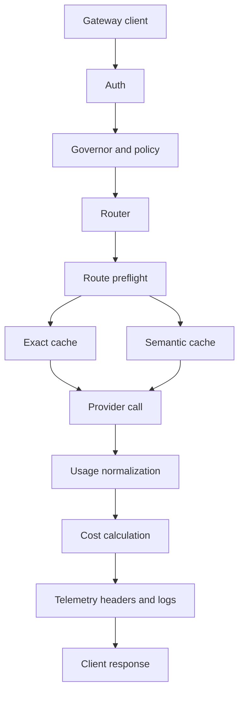
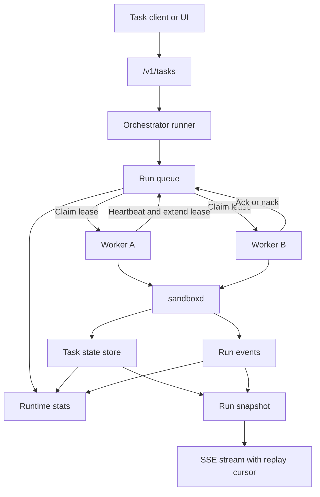

# Hecate

[](https://github.com/chicoxyzzy/hecate/actions/workflows/test.yml)
[](https://goreportcard.com/report/github.com/chicoxyzzy/hecate)
[](go.mod)
[](LICENSE)
[](https://opentelemetry.io/)

Hecate is an open-source AI gateway and agent-task runtime that gives teams one operational control plane across cloud and local models, with built-in policy, spend controls, and first-class OpenTelemetry.

## Table Of Contents

- [What Hecate Is Today](#what-hecate-is-today)
- [Architecture](#architecture)
- [Quick Start](#quick-start)
- [Provider Model](#provider-model)
- [Auth, Policy, And Spend](#auth-policy-and-spend)
- [Observability](#observability)
- [Operator UI](#operator-ui)
- [Using Hecate For Agent Tasks](#using-hecate-for-agent-tasks)
- [Using Hecate With Codex And Claude Code](#using-hecate-with-codex-and-claude-code)
- [Durable Queue Execution Flow](#durable-queue-execution-flow)
- [Config Highlights](#config-highlights)
- [Docs](#docs)
- [Commands](#commands)
- [Roadmap](#roadmap)

## What Hecate Is Today

Hecate today is a practical runtime you can use in two ways:

- as a gateway for OpenAI-compatible and Anthropic-style traffic with routing,
  auth, policy, budgets, and observability
- as a task runtime for queued agent work with approvals, sandboxed execution,
  persisted run state/events, and resumable runs

That means one deployment can serve both model access and agent-style execution
loops, while keeping operators in control of cost, safety, and traceability.

Storage backends used across the system include `memory`, `Redis`, and `Postgres`.

## Architecture

Gateway client flow:



Task client flow:



## Quick Start

### Option A: Docker (zero toolchain prerequisites)

```bash
docker compose up
open http://127.0.0.1:8080
```

On the first run, the gateway auto-generates an admin bearer token and
prints it to the container logs inside a banner like:

```
============================================================
  Hecate first-run setup — admin bearer token generated.

    7f2a91b... (truncated)

  Saved to /data/hecate.bootstrap.json (mode 0600).
============================================================
```

Copy the token from the logs (`docker compose logs gateway`), open the UI,
and paste it into the prompt. The browser remembers it in localStorage;
subsequent visits go straight to the dashboard. If you scroll past the
banner, the token also lives in the bootstrap file on the `hecate-data`
volume — the gateway image is distroless, so use `docker compose cp` to
copy it out without a shell:

```bash
docker compose cp gateway:/data/hecate.bootstrap.json - | tar -xO | jq -r .admin_token
```

(`docker compose cp ... -` emits a tar archive, hence the `tar -xO`.)
Restarts of the same volume reuse the same token.

Configure providers through the UI once the token is in, or by creating a
`.env` file before `docker compose up` (the compose stack picks it up
automatically).

Optional services live behind profiles:

```bash
docker compose --profile postgres up    # adds Postgres for state persistence
docker compose --profile ollama up      # adds Ollama on :11434 for local models
docker compose --profile full up        # everything
```

### Option B: Local build (Go + Bun)

1. Copy env defaults and configure at least one provider:

```bash
cp .env.example .env
# Edit .env — at minimum set GATEWAY_DEFAULT_MODEL plus a PROVIDER_*_API_KEY
```

2. Build the gateway with the UI bundled in (single binary, single port):

```bash
make ui-install
make build
make serve
```

The gateway and the operator UI are both served from
`http://127.0.0.1:8080`. `make serve` stops any earlier `./gateway` process
still bound to that port before starting, so re-running it is always safe.

Alternatively, for live UI iteration with hot reload, run the gateway and
the Vite dev server side by side:

```bash
make dev          # gateway on :8080 (no UI bundle hot-reloaded)
make ui-dev       # Vite on :5173, proxying API calls to :8080
```

Default addresses:

- gateway + bundled UI (production): `http://127.0.0.1:8080`
- Vite dev server (UI hot reload): `http://127.0.0.1:5173`

## Provider Model

Hecate uses a vendor-neutral provider layer at the runtime boundary. It treats
OpenAI-compatible upstreams and Anthropic Messages API as first-class paths.

Core provider env knobs:

- `PROVIDER_<NAME>_API_KEY`
- `PROVIDER_<NAME>_BASE_URL`
- `PROVIDER_<NAME>_DEFAULT_MODEL`

Advanced overrides such as protocol, API version, and timeout are also
available when needed.

Built-in cloud presets:

- `anthropic`
- `deepseek`
- `google`
- `groq`
- `mistral`
- `openai`
- `together`
- `xai`

Built-in local presets:

- `llamacpp`
- `lmstudio`
- `localai`
- `ollama`

Default local base URLs:

- `llamacpp`: `http://127.0.0.1:8080/v1`
- `lmstudio`: `http://127.0.0.1:1234/v1`
- `localai`: `http://127.0.0.1:8080/v1`
- `ollama`: `http://127.0.0.1:11434/v1`

## Auth, Policy, And Spend

Auth supports:

- admin bearer token (auto-generated on first run when `GATEWAY_AUTH_TOKEN`
  is unset, persisted to the bootstrap file, printed once to stderr)
- persisted API keys from the control plane

Control plane supports:

- tenant and API key management
- persisted provider management with encrypted secrets
- provider enable/disable and rotation flows
- policy and pricebook CRUD
- audit history

Spend/governor supports:

- budget accounting and enforcement
- warning thresholds, top-ups, resets, and history
- request denial as `402` on budget exhaustion
- per-key rate limiting with `X-RateLimit-*` headers

## Observability

Observability includes:

- request IDs, trace IDs, and span IDs in response headers
- first-class OpenTelemetry traces, metrics, and logs
- structured logs
- local trace inspection over HTTP
- OTLP HTTP export for traces, metrics, and logs
- optional request/response trace body capture (`GATEWAY_TRACE_BODIES=true`)
- runtime telemetry health and SLO snapshots via `/admin/runtime/stats`

For full telemetry details, see [`docs/telemetry.md`](docs/telemetry.md).

## Operator UI

The operator UI includes:

- provider/model visibility and health status
- managed provider lifecycle flows (enable/disable/delete/rotate credentials)
- playground and runtime metadata inspection
- task creation, run starts, approvals, cancellation, and live stdout/stderr
- telemetry health panel with signal status and run SLO cards
- trace inspection
- budget admin flows
- tenant/API key management and control-plane activity views

The app shell lives in `ui/src/app`, shared console primitives live in
`ui/src/features/shared`, and feature-owned styles live beside feature views.

## Using Hecate For Agent Tasks

Hecate is already useful behind agent clients even when orchestration logic
still lives in the client.

Current task-runtime foundation:

- task/run/step/artifact/approval APIs
- shell, file, and git executors
- out-of-process `cmd/sandboxd`
- per-run workspace provisioning
- sandbox policy controls (roots, read-only mode, timeout, network denial)
- policy-driven approvals (`shell_exec`, `git_exec`, `file_write`, `network_egress`)
- queueing, cancellation, retry/resume APIs
- persisted run events and SSE stream resume (`after_sequence`, `Last-Event-ID`)
- durable distributed queue semantics via Postgres lease claims

## Using Hecate With Codex And Claude Code

Hecate supports both OpenAI-compatible clients and Anthropic Messages clients, so you can point Codex and Claude Code at one gateway. These are examples, not exclusive integrations.

Use:

- OpenAI-compatible path: `POST /v1/chat/completions`
- Anthropic path: `POST /v1/messages`
- Discovery: `GET /v1/models`

For copy-paste setup and auth/header examples, see [`docs/client-integration.md`](docs/client-integration.md).

## Config Highlights

The full env surface lives in `.env.example`; the table-of-contents below
covers the knobs operators reach for most often. Anything not listed
here keeps a sensible default — see [`internal/config/config.go`](internal/config/config.go)
for the authoritative list.

### Auth and data

| Variable | Default | What it does |
|---|---|---|
| `GATEWAY_AUTH_TOKEN` | auto-generated | Admin bearer token. Empty → generated on first run, persisted to the bootstrap file, printed once to stderr. |
| `GATEWAY_DATA_DIR` | `.` | Where auto-generated state goes (the bootstrap file by default). Mount a volume here in production. |
| `GATEWAY_CONTROL_PLANE_SECRET_KEY` | auto-generated | AES-GCM key for encrypted provider credentials at rest. Empty → generated and persisted. |

### Storage backends

Every store accepts `memory` (in-process, ephemeral) by default. Switch
to `postgres` (or `redis` where available) for persistence across restarts.

| Variable | Accepted values |
|---|---|
| `GATEWAY_CONTROL_PLANE_BACKEND` | `memory` \| `redis` \| `postgres` (`none` is a legacy synonym for `memory`) |
| `GATEWAY_RETENTION_HISTORY_BACKEND` | `memory` \| `redis` \| `postgres` |
| `GATEWAY_CHAT_SESSIONS_BACKEND` | `memory` \| `postgres` |
| `GATEWAY_TASKS_BACKEND` | `memory` \| `postgres` |
| `GATEWAY_TASK_QUEUE_BACKEND` | `memory` \| `postgres` |
| `GATEWAY_CACHE_BACKEND` | `memory` \| `redis` \| `postgres` |
| `GATEWAY_SEMANTIC_CACHE_BACKEND` | `memory` \| `postgres` |
| `GATEWAY_BUDGET_BACKEND` | `memory` \| `redis` \| `postgres` |

A single `POSTGRES_DSN` and the top-level `REDIS_*` block configure the
clients that any of the above can share. If any backend is set to
`postgres`, `POSTGRES_DSN` must be reachable at startup or the gateway
exits — there is no silent fallback to `memory`.

### Agent task runtime

| Variable | Default | What it does |
|---|---|---|
| `GATEWAY_TASK_QUEUE_WORKERS` | `1` | Concurrency: how many runs the queue dispatches in parallel. |
| `GATEWAY_TASK_QUEUE_BUFFER` | `128` | In-memory queue capacity (memory backend only). |
| `GATEWAY_TASK_QUEUE_LEASE_SECONDS` | `30` | How long a worker holds a claimed run before it can be reclaimed. |
| `GATEWAY_TASK_APPROVAL_POLICIES` | `shell_exec` | Comma-separated approval gates: `shell_exec`, `git_exec`, `file_write`, `network_egress`. |
| `GATEWAY_TASK_MAX_CONCURRENT_PER_TENANT` | `0` | Per-tenant concurrency cap. `0` = unlimited. |

### Telemetry

OpenTelemetry traces, metrics, and logs are off by default. See
[`docs/telemetry.md`](docs/telemetry.md) for the full export surface
(`GATEWAY_OTEL_*` env vars, samplers, OTLP recipes).

## Docs

- [Client Integration (Codex And Claude Code)](docs/client-integration.md)
- [Runtime API Notes](docs/runtime-api.md)
- [Telemetry And OTLP Notes](docs/telemetry.md)
- [OTLP Collector Recipes And Runbooks](docs/telemetry.md#known-good-otlp-recipes)

## Commands

```bash
make dev
make test
make ui-install
make ui-dev
make ui-build
```

## Roadmap

Roadmap is organized into near-term runtime priorities and platform hardening.

Near term:

1. checkpoint controls for partial replay and selective continuation
2. broader policy-driven approval classes with safer defaults
3. deeper task UI workflows for bulk operations and richer artifact/diff views

Platform:

1. clearer route diagnostics and failure explanations
2. automated provider pricebook ingestion and sync
3. deployment reference stacks for local and production environments

## License

MIT. See [`LICENSE`](LICENSE).
