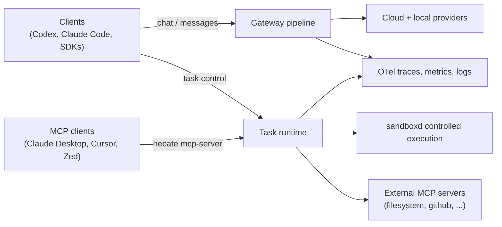

# Hecate

[](https://github.com/chicoxyzzy/hecate/actions/workflows/test.yml)
[](https://goreportcard.com/report/github.com/chicoxyzzy/hecate)
[](go.mod)
[](LICENSE)
[](https://opentelemetry.io/)

Hecate is an open-source AI gateway and agent-task runtime that gives teams one operational control plane across cloud and local models, with built-in policy, spend controls, and OpenTelemetry.

One deployment serves both **model access** (OpenAI- and Anthropic-shaped traffic) and **agent-style execution loops** (queued tasks with approvals, controlled shell/file/git execution, resumable runs), while keeping operators in control of cost, safety, and traceability.


## Table Of Contents

- [Quick Start](#quick-start)
- [Connect Your Client](#connect-your-client)
- [Architecture](#architecture)
- [Operator UI](#operator-ui)
- [Auth, Policy, And Spend](#auth-policy-and-spend)
- [Observability](#observability)
- [Config Highlights](#config-highlights)
  - [Auth and data](#auth-and-data)
  - [Storage backends](#storage-backends)
  - [Agent task runtime](#agent-task-runtime)
  - [MCP integration](#mcp-integration)
  - [Rate limiting](#rate-limiting)
  - [Telemetry](#telemetry)
- [Docs](#docs)
- [Status](#status)
- [License](#license)

## Quick Start

```bash
docker compose up
```

The gateway boots on `http://127.0.0.1:8080`, generates an admin bearer token, and prints it to the container logs inside a banner:

```
============================================================
  Hecate first-run setup — admin bearer token generated.

    7f2a91b... (truncated)

  Saved to /data/hecate.bootstrap.json (mode 0600).
============================================================
```

Open the UI, paste the token, and the first-run wizard walks you through connecting a provider:


The browser remembers the token in `localStorage`; subsequent visits go straight to the dashboard. To pre-seed providers, drop a `.env` next to `docker-compose.yml` before booting — see [`docs/providers.md`](docs/providers.md) for the catalog.

Operating the docker stack — Postgres/Ollama profiles, image pinning, recovering a lost admin token, resetting state — is in [`docs/deployment.md`](docs/deployment.md). Setting up a local source build with hot-reload is in [`docs/development.md`](docs/development.md).

## Connect Your Client

Hecate speaks both shapes natively, so existing CLIs work without code changes:

| Client | Endpoint to set | Auth header |
|---|---|---|
| **Codex** (OpenAI Chat Completions) | `OPENAI_BASE_URL=http://127.0.0.1:8080/v1` | `OPENAI_API_KEY=<bearer or tenant key>` |
| **Claude Code** (Anthropic Messages) | `ANTHROPIC_BASE_URL=http://127.0.0.1:8080` | `ANTHROPIC_API_KEY=<bearer or tenant key>` |
| **Any OpenAI/Anthropic SDK** | their `base_url` knob → `…/v1` | the SDK's API-key knob |

The Operator UI's **Admin → Integrations** tab gives you copy-paste env-var snippets pre-filled with your gateway URL. For full details — `GET /v1/models` discovery, vision content, gateway-only vs. runtime modes, common 4xx codes — see [`docs/client-integration.md`](docs/client-integration.md).

**Terminology:** custom clients are supported today. That means Codex, Claude Code, OpenAI/Anthropic SDKs, curl scripts, or internal tools can point at Hecate using the existing OpenAI-compatible or Anthropic-compatible API shapes. Custom providers are different: adding arbitrary new upstream provider records is not a first-class alpha workflow yet. Provider management is currently built around the shipped preset catalog.

## Architecture

Hecate is two concurrent surfaces in one Go binary: a **gateway** for OpenAI- and Anthropic-shaped client traffic, and a **task runtime** for queued agent work. Both share auth, budgets, observability, and an MCP integration layer — but their request paths are independent, so you can use either in isolation.



For the full request lifecycle, error short-circuits, lease semantics, and storage tier matrix, see [`docs/architecture.md`](docs/architecture.md).

## Operator UI

The operator UI is the same binary, served at `/`. Every dashboard view is also a thin layer over the public API, so anything you can do in the UI is scriptable.

Major surfaces:

- **Chat playground** — exercise any configured model, with runtime metadata (provider, model, route reason, cost) inline per turn. Sessions persist in the sidebar; the system-prompt editor floats above the input.
- **Providers** — credential lifecycle, enable/disable, health status, base-URL overrides.
- **Admin → Pricebook** — catalog of every cloud-provider model the gateway knows about (`priced` / `unpriced` / `deprecated`), filterable by provider and status. Per-row Import or bulk "Import all" pulls token prices from [LiteLLM](https://github.com/BerriAI/litellm) (MIT-licensed, attribution in [`NOTICE.md`](NOTICE.md)). Manually-edited rows are protected from blanket imports — operators opt in explicitly via the consent dialog's "Override manual" section.
- **Admin → Budget** — credit, top-up, reset; warning thresholds; per-tenant scope.
- **Admin → Tenants & Keys** — control-plane tenant lifecycle and API key management with allowed-providers/models scoping.
- **Admin → Integrations** — copy-paste env-var snippets for Codex, Claude Code, and curl smoke tests. The base URL is auto-filled from your browser location; pair with a key from the Keys tab.
- **Observe** — request ledger, trace inspector with route-report drilldown, OTel signal health.
- **Tasks** — task creation, run start/cancel/retry/resume, approvals, live SSE stdout/stderr.

The app shell lives in `ui/src/app`, shared console primitives live in `ui/src/features/shared`, and feature-owned styles live beside feature views.

### UI tour

<details>
<summary>Providers — credential, health, base-URL panel per preset</summary>


</details>

<details>
<summary>Admin → Pricebook — catalog with status filters and LiteLLM import</summary>


</details>

<details>
<summary>Admin → Budget — credit, top-up, warning thresholds</summary>


</details>

<details>
<summary>Admin → Tenants — control-plane tenant table with allowed-provider/model scoping</summary>


</details>

<details>
<summary>Admin → Keys — API key management with rotate / revoke flows</summary>


</details>

<details>
<summary>Admin → Integrations — copy-paste env vars for Codex, Claude Code, and curl</summary>


</details>

<details>
<summary>Observe — request ledger and trace inspector</summary>


</details>

<details>
<summary>Tasks — agent runtime workspace with approvals + live stream</summary>


</details>

## Auth, Policy, And Spend

- **Auth** — admin bearer (auto-generated on first run; override with `GATEWAY_AUTH_TOKEN`) plus persisted per-tenant API keys with allowed-providers / allowed-models scoping.
- **Control plane** — tenants, keys, providers (encrypted secrets at rest), policy rules, the pricebook, and a full audit history.
- **Governor** — per-tenant budgets with warning thresholds, top-ups, resets, and history; `402` on exhaustion; per-key token-bucket rate limiting with `X-RateLimit-*` headers and `429` on overflow.

## Observability

- Request, trace, and span IDs in every response header
- OpenTelemetry traces, metrics, and logs over OTLP/HTTP — plus structured stdout logs
- Local trace inspector served at `/`, including route candidates, skip reasons, failover, cost, and cache path
- Optional request / response body capture in spans (`GATEWAY_TRACE_BODIES=true`)
- Runtime SLO snapshots at `/admin/runtime/stats`

Full export surface and collector recipes: [`docs/telemetry.md`](docs/telemetry.md).

## Config Highlights

The full env surface lives in `.env.example`; the table below covers the knobs operators reach for most often. Anything not listed here keeps a sensible default — see [`internal/config/config.go`](internal/config/config.go) for the authoritative list.

### Auth and data

| Variable | Default | What it does |
|---|---|---|
| `GATEWAY_AUTH_TOKEN` | auto-generated | Admin bearer token. Empty → generated on first run, persisted to the bootstrap file, printed once to stderr. |
| `GATEWAY_DATA_DIR` | `.data` (local), `/data` (docker) | Where auto-generated state goes (the bootstrap file by default). Mount a volume here in production. |
| `GATEWAY_CONTROL_PLANE_SECRET_KEY` | auto-generated | AES-GCM key for encrypted provider credentials at rest. Empty → generated and persisted. |

### Storage backends

Three tiers, picked per subsystem:

- **`memory`** — in-process, ephemeral. Right for tests and local iteration with the bare binary.
- **`sqlite`** — single-file durable store, embedded (pure-Go driver, no CGO). Right for single-node production. One file at `GATEWAY_SQLITE_PATH` (default `.data/hecate.db` for the bare binary, `/data/hecate.db` in the docker image, persisted on the `hecate-data` volume) is shared across every subsystem that opts in.
- **`postgres`** — multi-node production. Required for the semantic cache (pgvector).

| Subsystem | Env var | `memory` | `sqlite` | `postgres` |
|---|---|:---:|:---:|:---:|
| Control plane | `GATEWAY_CONTROL_PLANE_BACKEND` | ☆ | ★ | ✓ |
| Retention history | `GATEWAY_RETENTION_HISTORY_BACKEND` | ☆ | ★ | ✓ |
| Chat sessions | `GATEWAY_CHAT_SESSIONS_BACKEND` | ☆ | ★ | ✓ |
| Tasks | `GATEWAY_TASKS_BACKEND` | ☆ | ★ | ✓ |
| Task queue | `GATEWAY_TASK_QUEUE_BACKEND` | ☆ | ★ | ✓ |
| Exact cache | `GATEWAY_CACHE_BACKEND` | ☆ | ★ | ✓ |
| Semantic cache¹ | `GATEWAY_SEMANTIC_CACHE_BACKEND` | ✓ | —² | ✓ |
| Budget | `GATEWAY_BUDGET_BACKEND` | ☆ | ★ | ✓ |

☆ = default for the bare binary · ★ = default for the docker image · ✓ = supported · — = not supported

The docker image picks SQLite for every durable subsystem so `docker compose up` persists tenants / keys / pricebook / tasks / chat sessions across restarts without extra config. Bare-binary runs default to memory across the board so tests and quick experiments don't accidentally write a `.data/hecate.db` file. To override either default, set the relevant `GATEWAY_*_BACKEND=…` env var.

¹ **Semantic cache is disabled by default** (`GATEWAY_SEMANTIC_CACHE_ENABLED=false`) — when off, every chat completion bypasses it entirely regardless of the backend setting. Set `GATEWAY_SEMANTIC_CACHE_ENABLED=true` to turn it on; then `_BACKEND` chooses where to store vectors. The bare-binary memory store does cosine in Go (good for ≲10k entries); pgvector handles indexed search at scale.

² **Semantic cache on SQLite is intentionally unsupported.** Indexed vector similarity needs the [`sqlite-vec`](https://github.com/asg017/sqlite-vec) extension, which is C and only loads into native (CGO) or WASM (Wazero) SQLite drivers. The gateway uses [`modernc.org/sqlite`](https://pkg.go.dev/modernc.org/sqlite) — a pure-Go ccgo translation — to keep the single-static-binary story; modernc cannot load native extensions. Single-node deploys that need persistent semantic cache should run Postgres *for this subsystem only* — backends are picked per-subsystem, so the rest of state can still live in SQLite. The `memory` backend is fine for ≲10k cached prompts.

`POSTGRES_DSN` configures the shared Postgres client. If any backend is set to `postgres`, the DSN must be reachable at startup or the gateway exits — there is no silent fallback to `memory`.

### Agent task runtime

Tasks of `execution_kind=agent_loop` run an LLM-driven tool-using loop with built-in `shell_exec` / `git_exec` / `file_write` / `read_file` / `list_dir` / `http_request` tools, mid-loop approval gating, per-task cost ceilings, and retry-from-turn-N for exploring alternate paths. Every run gets its own workspace — a clone of the source by default, or the source directly via `workspace_mode=in_place`. See [`docs/agent-runtime.md`](docs/agent-runtime.md) for the full contract.

| Variable | Default | What it does |
|---|---|---|
| `GATEWAY_TASK_QUEUE_WORKERS` | `1` | Concurrency: how many runs the queue dispatches in parallel. |
| `GATEWAY_TASK_QUEUE_BUFFER` | `128` | In-memory queue capacity (memory backend only). |
| `GATEWAY_TASK_QUEUE_LEASE_SECONDS` | `30` | How long a worker holds a claimed run before it can be reclaimed. |
| `GATEWAY_TASK_APPROVAL_POLICIES` | `shell_exec` | Comma-separated approval gates: `shell_exec`, `git_exec`, `file_write`, `network_egress`. Also controls mid-loop tool gating for `agent_loop` runs. |
| `GATEWAY_TASK_MAX_CONCURRENT_PER_TENANT` | `0` | Per-tenant concurrency cap. `0` = unlimited. |
| `GATEWAY_TASK_AGENT_LOOP_MAX_TURNS` | `8` | Hard ceiling on LLM round-trips per `agent_loop` run. |
| `GATEWAY_TASK_AGENT_SYSTEM_PROMPT` | `""` | Global (broadest) layer of the four-layer agent system prompt. |

### MCP integration

Hecate participates in MCP on both sides: it can expose its task / session / observability surfaces to MCP-aware clients (Claude Desktop, Cursor, Zed) via the `hecate mcp-server` subcommand, *and* `agent_loop` tasks can configure external MCP servers (filesystem, github, …) whose tools become available to the LLM. See [`docs/mcp.md`](docs/mcp.md) for the full contract — both directions, transports (stdio + Streamable HTTP), secret-aware config, approval policies (`auto` / `require_approval` / `block`), and the shared client cache.

| Variable | Default | What it does |
|---|---|---|
| `GATEWAY_TASK_MAX_MCP_SERVERS_PER_TASK` | `16` | Max `mcp_servers` entries an `agent_loop` task may declare. Over-cap creates fail with a 400. `0` disables. |
| `GATEWAY_TASK_MCP_CLIENT_CACHE_MAX_ENTRIES` | `256` | Soft cap on cached MCP upstream clients. LRU-idle eviction at the cap; over-cap inserts allowed when every entry is in use. `0` disables. |
| `GATEWAY_TASK_MCP_CLIENT_CACHE_PING_INTERVAL` | `60s` | How often the cache pings idle MCP clients to detect wedged subprocesses (alive but not responsive). `0` disables; reactive eviction on transport-closed errors still applies. |
| `GATEWAY_TASK_MCP_CLIENT_CACHE_PING_TIMEOUT` | `5s` | Per-ping deadline. Failure or timeout evicts the entry. |

### Rate limiting

Per-API-key token-bucket throttling on `POST /v1/chat/completions` and `POST /v1/messages`. Off by default; opt in by setting `GATEWAY_RATE_LIMIT_ENABLED=true`. Every response — allowed or denied — carries `X-RateLimit-Limit`, `X-RateLimit-Remaining`, and `X-RateLimit-Reset` (Unix seconds). Over-limit requests get `429 Too Many Requests` with a `rate_limit_exceeded` error code. Bucketing is keyed on the tenant API key's `key_id`; principals without one (admin bearer tokens, anonymous traffic) share a single `"anonymous"` bucket — set per-tenant API keys if you need separate budgets per caller.

| Variable | Default | What it does |
|---|---|---|
| `GATEWAY_RATE_LIMIT_ENABLED` | `false` | Master toggle. Headers are populated only when enabled. |
| `GATEWAY_RATE_LIMIT_RPM` | `60` | Steady-state refill rate, per API key. Also the value of `X-RateLimit-Limit`. |
| `GATEWAY_RATE_LIMIT_BURST` | `0` (= RPM) | Maximum tokens that can accumulate (the bucket size). `0` falls back to RPM, giving a burst of one minute's worth of refill. |

### Telemetry

OpenTelemetry traces, metrics, and logs are off by default. See [`docs/telemetry.md`](docs/telemetry.md) for the full export surface (`GATEWAY_OTEL_*` env vars, samplers, OTLP recipes).

## Docs

- [Architecture](docs/architecture.md) — request flow, lease semantics, storage tier matrix
- [Agent runtime](docs/agent-runtime.md) — `agent_loop` tools, workspace modes, four-layer system prompt, mid-loop approval, cost tracking, retry-from-turn
- [Deployment](docs/deployment.md) — compose profiles, image pinning, lost-token recovery, resets, backend tier choice
- [Providers](docs/providers.md) — built-in catalog, configuration, health/circuit breaking, custom-provider status
- [Client Integration (Codex And Claude Code)](docs/client-integration.md) — point existing CLIs at Hecate; choose between gateway-only and runtime modes
- [MCP integration](docs/mcp.md) — both directions: expose Hecate to Claude Desktop / Cursor / Zed via `hecate mcp-server`, and configure external MCP servers (filesystem, github, …) on `agent_loop` tasks
- [Runtime API Notes](docs/runtime-api.md) — task / run / step / approval endpoints, queue + lease model, resume + retry-from-turn semantics
- [Event catalog](docs/events.md) — every event Hecate emits, payload shapes, when each fires
- [Telemetry, OTLP, And Collector Recipes](docs/telemetry.md) — OTel spans + metrics, response headers, OTLP wiring, what's done vs. not
- [Release](docs/release.md) — alpha release gate, versioning, release-note expectations
- [Known limitations](docs/known-limitations.md) — current alpha boundaries and non-goals
- [Development](docs/development.md) — local build, UI hot reload, full make-target reference, screenshot tooling

## Status

Hecate is pre-1.0 and ready for early technical users: single-binary deploys, durable state, and OpenTelemetry-first operations are in place, while some APIs and safety boundaries are still evolving. The table below sketches what's usable today vs. what's still moving.

| Area | State | Notes |
|---|---|---|
| OpenAI / Anthropic gateway | **Usable** | Chat Completions, Messages, streaming, vision, `/v1/models` discovery |
| Provider catalog | **Usable** | Built-in presets, encrypted credentials, health, circuit breaking, routing readiness |
| Auth, tenants, keys | **Usable** | Admin bearer + per-tenant API keys with allowed-providers/models scoping |
| Budgets + rate limits | **Usable** | Per-tenant credit, warning thresholds, `429` with `X-RateLimit-*` |
| Agent task runtime | **Alpha** | `agent_loop` tools, mid-loop approvals, cost ceilings, retry-from-turn-N |
| MCP integration | **Alpha** | Both directions: `hecate mcp-server` and external servers on `agent_loop` |
| Telemetry | **Usable** | OTLP traces / metrics / logs, response headers, runtime SLO snapshots |
| Storage tiers | **Usable** | Memory / SQLite / Postgres, picked per subsystem |
| Operator UI | **Evolving** | Core flows shipped; bulk ops + richer artifact / diff views still landing |
| Checkpoint controls | **Evolving** | Resume + retry-from-turn shipped; partial-replay + selective continuation in design |
| Execution isolation | **Evolving** | Out-of-process `sandboxd` boundary and policy checks shipped; stronger OS-level isolation is future work |
| Approval policy classes | **Evolving** | Per-tool gating shipped; broader policy-driven classes with safer defaults next |
| Route diagnostics | **Usable** | Per-request route reports with selected/skipped candidates, skip reasons, failover, cost, and cache path |

Out-of-band but on the radar: deployment reference stacks (k8s, Nomad, fly.io) beyond the bundled `docker compose`.

## License

MIT. See [`LICENSE`](LICENSE).

Third-party data and software notices live in [`NOTICE.md`](NOTICE.md) — most notably the LiteLLM pricing data fetched at runtime by the pricebook import feature.
