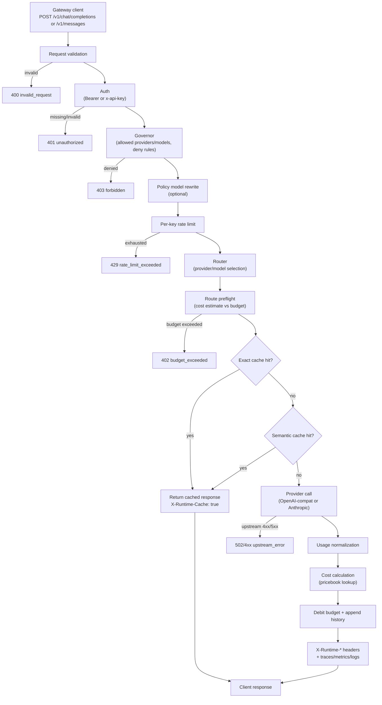
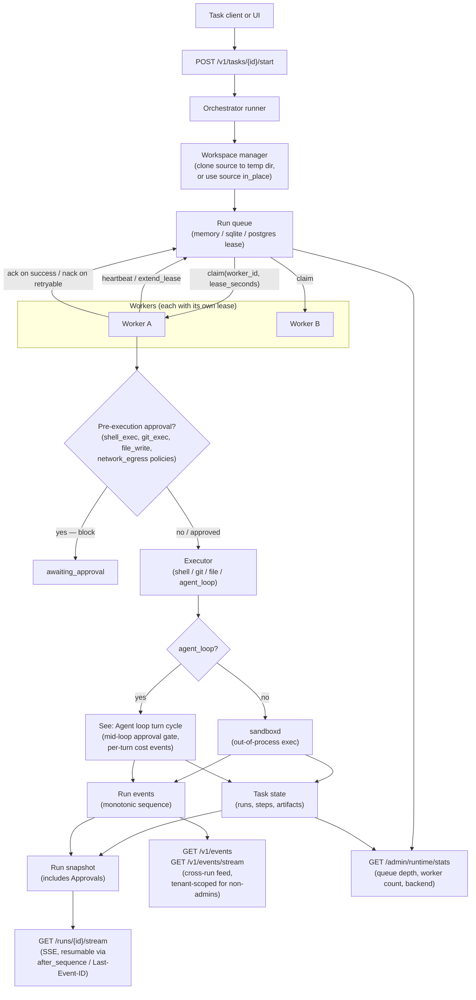
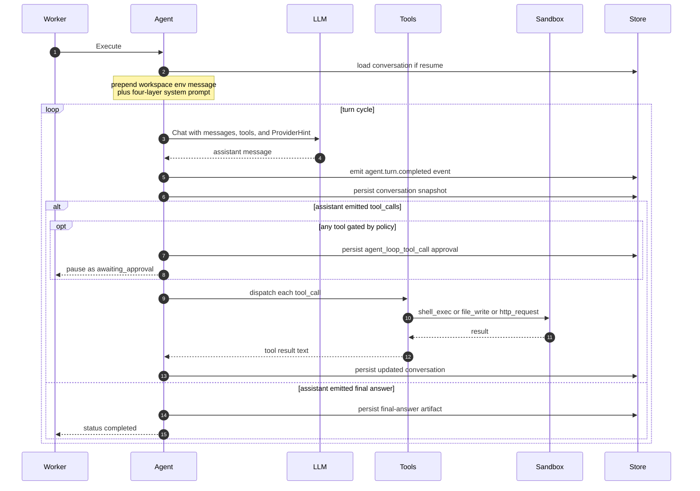

# Architecture

Hecate splits cleanly into two concurrent surfaces: a **gateway** for OpenAI- and Anthropic-shaped client traffic, and a **task runtime** for queued agent work. Both are served from the same binary on the same port, but the request paths are independent — you can use either in isolation, or both side-by-side.

## Gateway request flow

Every chat / messages call goes through the same pipeline. Each gate can short-circuit the request — auth/policy/budget failures never spend upstream tokens, and a cache hit returns without calling the provider at all. Errors produce a fixed status code per gate so client SDKs can handle them deterministically.

Key invariants:

- **Auth runs once.** The handler resolves the principal up front; downstream stages read from the context, never re-validate the bearer.
- **Policy/budget can deny without an upstream call.** A budget-exceeded request returns `402` with the gateway's own body — no provider tokens are spent.
- **Cache hits short-circuit fully.** Exact and semantic cache both bypass the provider call entirely; the response carries `X-Runtime-Cache: true` and the original cached headers.
- **Cost calculation is deterministic.** Pricebook is read after the provider returns usage; the same `(provider, model, usage)` tuple always produces the same cost in micros USD.
- **CheckRoute is read-not-reservation.** Two concurrent requests can both pass when balance covers each individually but not their sum — the budget can briefly go negative under contention. Pinned in [tests](../internal/governor/governor_test.go) so a "fix" doesn't silently introduce write contention.

## Task runtime flow

Tasks are durable: a run survives process restarts, can be resumed from a terminal state, and is leased to one worker at a time so two replicas can share a queue without stepping on each other.

Key invariants:

- **Workspace before queue.** Every run has a workspace before a worker can claim it. Default is an isolated clone of `task.WorkingDirectory` (or `task.Repo`) under `${TMPDIR}/hecate-workspaces/<task_id>/<run_id>`; opt in to `workspace_mode=in_place` to run directly in the source. The sandbox `AllowedRoot` is the workspace path either way.
- **Lease before work.** A worker doesn't see a `task_run` until it has claimed a lease; if it crashes, the lease expires and another worker can pick the run up. Pinned by `GATEWAY_TASK_QUEUE_LEASE_SECONDS`.
- **Sandbox is out-of-process.** Shell, file, and git execution runs inside `cmd/sandboxd`, which the worker invokes over an exec boundary with policy controls (roots, read-only mode, timeout, network denial). A bug in the sandboxed program can't crash the gateway.
- **Approvals are blocking and come in two flavors.** Pre-execution approval (shell/git/file kinds, or `sandbox_network=true`) halts the run at `awaiting_approval` before the executor runs. Mid-loop approval (`agent_loop_tool_call`, see below) halts an `agent_loop` run after a turn produced a gated tool call. Both resolve via `POST /approvals/{id}/resolve`.
- **Events are appended, not mutated.** Every step transition writes a `run_event` with a monotonic sequence number. The SSE stream replays from `after_sequence=N` or `Last-Event-ID`, so a disconnected client can re-join exactly where it left off. Each snapshot carries the run's approvals so the operator UI's banner stays in sync without a separate refetch.
- **Resume creates a new attempt.** A resumed run gets a fresh `run_id`; the original run stays terminal. The new run reuses the prior workspace so file state carries forward, gets the prior checkpoint context in step input, and inherits the chain's cumulative cost via `PriorCostMicrosUSD` so the per-task ceiling holds across the full chain.

## Agent loop turn cycle

When an `agent_loop` run executes, the worker drives the LLM through a tool-using loop. Each turn round-trips the model, optionally pauses for approval, dispatches tools, and persists the conversation. See [`agent-runtime.md`](agent-runtime.md) for the detailed contract.

Three runtime invariants worth pinning (full mechanics in [`agent-runtime.md`](agent-runtime.md)):

- **Workspace environment system message.** The loop prepends a machine-generated system message naming the workspace path, so the model uses the cloned cwd instead of the source path it sees in the user prompt. Without this, tool calls land outside the sandbox and fail with `escapes allowed root`.
- **Provider hint.** `ChatRequest.Scope.ProviderHint` is set from `run.Provider` (mirrored from `task.RequestedProvider`), so the operator's pinned provider actually routes — no fallback to the default for generic model ids.
- **Cost ceiling is task-cumulative.** The per-task `BudgetMicrosUSD` is checked against `priorCost + costSpent` after each turn, where `priorCost` includes every prior run in the resume chain. A chain of resumes can't escape the ceiling.

## Storage tiers

Three tiers — `memory`, `sqlite`, `postgres` — picked per subsystem via `GATEWAY_*_BACKEND` env vars. The bare binary defaults to `memory` everywhere; the docker image defaults to `sqlite` so `docker compose up` survives restarts. The semantic cache is the one subsystem with no `sqlite` option (indexed vector similarity needs the `sqlite-vec` extension, and the pure-Go SQLite driver can't load native extensions); single-node deploys that need persistent semantic search should run Postgres for that subsystem only.

The full per-subsystem matrix and footnotes live in [`README.md`](../README.md#storage-backends) — single source of truth. Implementation notes worth pinning here:

- One `GATEWAY_SQLITE_PATH` and one `POSTGRES_DSN` configure the shared clients across all opted-in subsystems.
- SQLite's task queue uses `BEGIN IMMEDIATE` plus `UPDATE … RETURNING` for atomic claim under WAL; Postgres uses `SELECT … FOR UPDATE SKIP LOCKED`. Both are race-tested.

## Why two flows in one binary

The shared deployment is deliberate. An operator who only needs LLM-gateway features still gets the task runtime endpoints (returning empty lists) without configuring anything; an operator who runs agent tasks shares the same auth, budgets, and observability with the model traffic. There is no separate "task daemon" to deploy.
