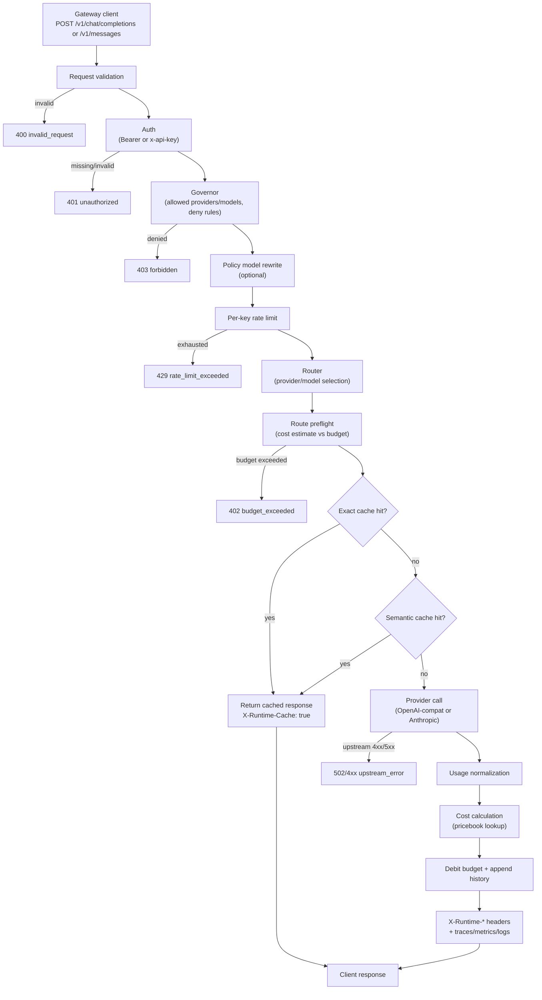
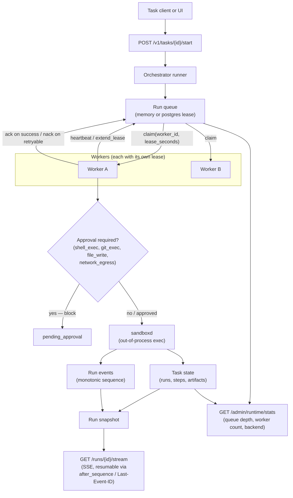

# Architecture

Hecate splits cleanly into two concurrent surfaces: a **gateway** for OpenAI- and Anthropic-shaped client traffic, and a **task runtime** for queued agent work. Both are served from the same binary on the same port, but the request paths are independent — you can use either in isolation, or both side-by-side.

## Gateway request flow

Every chat / messages call goes through the same pipeline. Each gate can short-circuit the request — auth/policy/budget failures never spend upstream tokens, and a cache hit returns without calling the provider at all. Errors produce a fixed status code per gate so client SDKs can handle them deterministically.

Key invariants:

- **Auth runs once.** The handler resolves the principal up front; downstream stages read from the context, never re-validate the bearer.
- **Policy/budget can deny without an upstream call.** A budget-exceeded request returns `402` with the gateway's own body — no provider tokens are spent.
- **Cache hits short-circuit fully.** Exact and semantic cache both bypass the provider call entirely; the response carries `X-Runtime-Cache: true` and the original cached headers.
- **Cost calculation is deterministic.** Pricebook is read after the provider returns usage; the same `(provider, model, usage)` tuple always produces the same cost in micros USD.
- **CheckRoute is read-not-reservation.** Two concurrent requests can both pass when balance covers each individually but not their sum — the budget can briefly go negative under contention. Pinned in [tests](../internal/governor/governor_test.go) so a "fix" doesn't silently introduce write contention.

## Task runtime flow

Tasks are durable: a run survives process restarts, can be resumed from a terminal state, and is leased to one worker at a time so two replicas can share a queue without stepping on each other.

Key invariants:

- **Lease before work.** A worker doesn't see a `task_run` until it has claimed a lease; if it crashes, the lease expires and another worker can pick the run up. Pinned by `GATEWAY_TASK_QUEUE_LEASE_SECONDS`.
- **Sandbox is out-of-process.** Shell, file, and git execution runs inside `cmd/sandboxd`, which the worker invokes over an exec boundary with policy controls (roots, read-only mode, timeout, network denial). A bug in the sandboxed program can't crash the gateway.
- **Approvals are blocking.** Steps that match an approval policy halt at `pending_approval` and don't tick the lease until a `POST /approvals/{id}/resolve` arrives.
- **Events are appended, not mutated.** Every step transition writes a `run_event` with a monotonic sequence number. The SSE stream replays from `after_sequence=N` or `Last-Event-ID`, so a disconnected client can re-join exactly where it left off.
- **Resume creates a new attempt.** A resumed run gets a fresh `run_id`; the original run stays terminal. The new run reuses the prior workspace so file state carries forward, and gets the prior checkpoint context (last completed step, last event sequence) in step input.

## Storage tiers

Every persistent component picks its own backend independently — there is no hard requirement to deploy Postgres for the gateway path, and there's no hard requirement to deploy Redis at all. The defaults give you a single-process gateway with no external dependencies; production deploys flip individual stores to Postgres for durability.

| Component | `memory` | `redis` | `postgres` |
|---|---|---|---|
| Control plane (tenants, keys, providers, policy, pricebook) | ✓ | ✓ | ✓ |
| Chat sessions | ✓ | — | ✓ |
| Tasks (runs, steps, artifacts, approvals, events) | ✓ | — | ✓ |
| Task queue (leases) | ✓ | — | ✓ |
| Exact response cache | ✓ | ✓ | ✓ |
| Semantic cache | ✓ | — | ✓ |
| Budget accounts and history | ✓ | ✓ | ✓ |
| Retention run history | ✓ | ✓ | ✓ |

`memory` is in-process and ephemeral — perfect for tests and local iteration, useless across restarts. `redis` is fast but volatile (no run-event durability). `postgres` is the production target: durable across restarts, supports lease-based queue claims, supports semantic-cache vector indexes.

## Why two flows in one binary

The shared deployment is deliberate. An operator who only needs LLM-gateway features still gets the task runtime endpoints (returning empty lists) without configuring anything; an operator who runs agent tasks shares the same auth, budgets, and observability with the model traffic. There is no separate "task daemon" to deploy.
