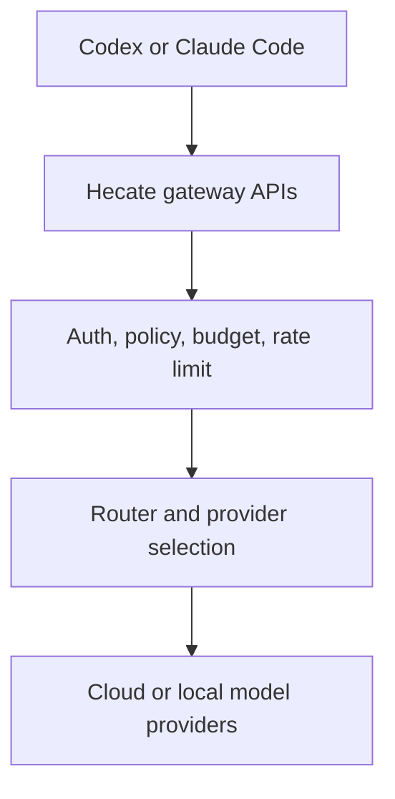
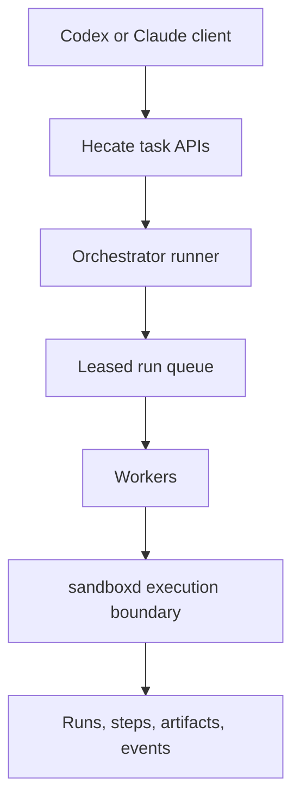

# Client Integration (Codex And Claude Code)

This guide explains how to point external coding clients at Hecate as the model gateway.

## Base URL and endpoints

Use your Hecate gateway URL (local default: `http://127.0.0.1:8080`).

Supported LLM-facing endpoints:

| Client style | Endpoint |
| --- | --- |
| OpenAI-compatible (Codex-style) | `POST /v1/chat/completions` |
| Anthropic Messages (Claude Code-style) | `POST /v1/messages` |
| Model discovery | `GET /v1/models` |

## Authentication options

Hecate accepts either:

- `Authorization: Bearer <token>`
- `x-api-key: <token>`

Token sources:

- `GATEWAY_AUTH_TOKEN` — admin token. Auto-generated on first run when unset; printed once to stderr inside a `Hecate first-run setup` banner and persisted in the bootstrap file (mode 0600) under `GATEWAY_DATA_DIR`. The default location is `.data/hecate.bootstrap.json` for local builds (`make serve`) and `/data/hecate.bootstrap.json` inside the Docker image. Read it back at any time:
  - Local: `jq -r .admin_token .data/hecate.bootstrap.json`
  - Docker: `docker compose cp hecate:/data/hecate.bootstrap.json - | tar -xO | jq -r .admin_token`
- Control-plane API keys — recommended for non-admin client access. Create them through the operator UI's Access tab once you've signed in with the admin token.

If both headers are present, Hecate uses `Authorization` first.

## Two operating modes

Hecate can be used in two different ways with Codex/Claude-style clients.

### Which mode should I choose?

| If you want... | Choose |
| --- | --- |
| Keep Codex/Claude tool orchestration as-is and only centralize model access/policy | Mode 1 (Gateway mode) |
| Move execution control into Hecate with queueing, approvals, and runtime events | Mode 2 (Runtime mode) |
| Use Hecate sandbox isolation for shell/file/git execution | Mode 2 (Runtime mode) |
| Minimal migration from existing OpenAI/Anthropic client usage | Mode 1 (Gateway mode) |

### Mode 1: Gateway mode (LLM proxy)

Use this when your client already orchestrates tools and execution.

- Endpoints: `/v1/chat/completions`, `/v1/messages`, `/v1/models`
- Orchestration happens in the client (Codex/Claude Code)
- Sandboxing happens in the client runtime
- Hecate handles routing, policy, budgets, rate limits, and telemetry



### Mode 2: Runtime mode (Hecate executes work)

Use this when you want Hecate to run task execution itself.

- Endpoints: `/v1/tasks/...`
- Orchestration happens in Hecate runner/queue
- Sandboxing happens in Hecate (`cmd/sandboxd`)
- Client becomes control-plane caller (create/start/approve/resume/cancel)



For runtime-mode endpoint details, see [`docs/runtime-api.md`](runtime-api.md).

## Codex setup

Most Codex/OpenAI-compatible tools can be configured with OpenAI-style env vars.

Example:

```bash
export OPENAI_BASE_URL="http://127.0.0.1:8080/v1"
export OPENAI_API_KEY="hecate-client-token"
```

If your Codex client exposes custom headers instead of `OPENAI_API_KEY`, set either:

- `Authorization: Bearer hecate-client-token`, or
- `x-api-key: hecate-client-token`.

## Claude Code setup

Claude Code and Anthropic-style clients usually support:

```bash
export ANTHROPIC_BASE_URL="http://127.0.0.1:8080"
export ANTHROPIC_API_KEY="hecate-client-token"
```

Hecate accepts this key via `x-api-key`. If your client supports explicit auth headers, `Authorization: Bearer ...` also works.

## Smoke tests

### 1) Models

```bash
curl -sS "http://127.0.0.1:8080/v1/models" \
  -H "Authorization: Bearer hecate-client-token"
```

### 2) OpenAI-compatible chat

```bash
curl -sS "http://127.0.0.1:8080/v1/chat/completions" \
  -H "Content-Type: application/json" \
  -H "Authorization: Bearer hecate-client-token" \
  -d '{
    "model": "gpt-4o-mini",
    "messages": [{"role": "user", "content": "hello"}]
  }'
```

### 3) Anthropic messages

```bash
curl -sS "http://127.0.0.1:8080/v1/messages" \
  -H "Content-Type: application/json" \
  -H "x-api-key: hecate-client-token" \
  -d '{
    "model": "gpt-4o-mini",
    "max_tokens": 64,
    "messages": [{"role": "user", "content": "hello"}]
  }'
```

## Common failures

- `401 unauthorized`: missing or invalid token.
- `403 forbidden`: token authenticated, but tenant/model/provider policy denies access.
- `402 payment_required`: budget is exhausted.
- `429 rate_limit_error`: request rate exceeded for the API key.

For response headers, traces, and OTLP details, see [`docs/telemetry.md`](telemetry.md).
