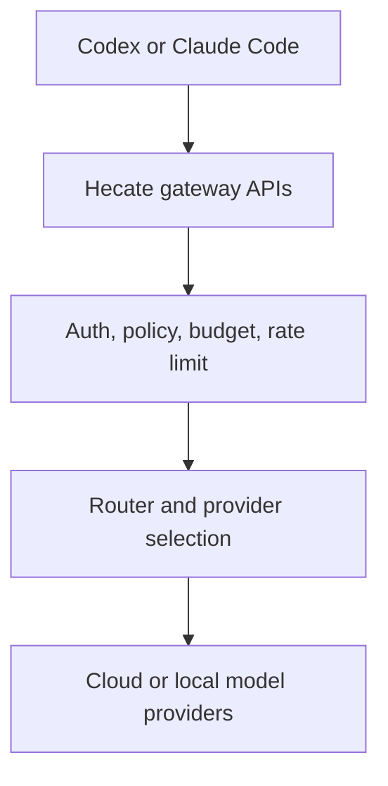
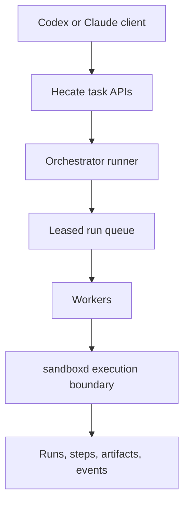

# Client Integration (Codex And Claude Code)

This guide explains how to point external coding clients at Hecate as the model gateway. Hecate accepts both OpenAI-compatible and Anthropic-shaped traffic on the same port, so one gateway URL works for both Codex-style and Claude-Code-style clients.

For the request lifecycle Hecate runs each call through (auth → policy → cache → router → provider), see [`architecture.md`](architecture.md#gateway-request-flow). For task-runtime (`/v1/tasks/...`) endpoints, see [`runtime-api.md`](runtime-api.md).

## Contents

- [The easy path — Admin → Integrations](#the-easy-path--admin--integrations)
- [Base URL and endpoints](#base-url-and-endpoints)
- [Authentication options](#authentication-options)
- [Two operating modes](#two-operating-modes)
- [Codex setup](#codex-setup)
- [Claude Code setup](#claude-code-setup)
- [Smoke tests](#smoke-tests)
- [Multi-modal content (vision)](#multi-modal-content-vision)
- [OpenAI request fields and cross-provider behavior](#openai-request-fields-and-cross-provider-behavior)
- [Common failures](#common-failures)

## The easy path — Admin → Integrations

The fastest way to wire a coding client up is the **Integrations** sub-tab in the operator UI's Admin view. The base URL is auto-filled from your browser location (so it works as-is for local dev, internal hostnames, and public deploys behind TLS terminators), each snippet has its own copy button, and the panel cross-links the Keys tab where you mint a scoped API key.


Workflow:

1. Open the operator UI, sign in with the admin token, navigate to **Admin → Integrations**.
2. Mint an API key in the **Keys** tab (scope it to a tenant, provider list, or model list as needed).
3. Copy the snippet for whichever client you're using (Codex / Claude Code), paste the API key in place of `<paste an API key from the Keys tab>`, and run.

The rest of this guide covers the same ground at the protocol level — useful for scripted setups, custom clients, and operators automating multi-environment provisioning.

## Base URL and endpoints

Use your Hecate gateway URL (local default: `http://127.0.0.1:8080`).

Supported LLM-facing endpoints:

| Client style | Endpoint |
| --- | --- |
| OpenAI-compatible (Codex-style) | `POST /v1/chat/completions` |
| Anthropic Messages (Claude Code-style) | `POST /v1/messages` |
| Model discovery | `GET /v1/models` |

## Authentication options

Hecate accepts either:

- `Authorization: Bearer <token>`
- `x-api-key: <token>`

Token sources:

- `GATEWAY_AUTH_TOKEN` — admin token. Auto-generated on first run when unset; printed once to stderr inside a `Hecate first-run setup` banner and persisted in the bootstrap file (mode 0600) under `GATEWAY_DATA_DIR`. To read it back later, see [Recovering a lost admin token](deployment.md#recovering-a-lost-admin-token) (docker) or [development.md § Reset state](development.md#reset-state) (local).
- Control-plane API keys — recommended for non-admin client access. Create them through the operator UI's Access tab once you've signed in with the admin token.

If both headers are present, Hecate uses `Authorization` first.

## Two operating modes

Hecate can be used in two different ways with Codex/Claude-style clients.

### Which mode should I choose?

| If you want... | Choose |
| --- | --- |
| Keep Codex/Claude tool orchestration as-is and only centralize model access/policy | Mode 1 (Gateway mode) |
| Move execution control into Hecate with queueing, approvals, and runtime events | Mode 2 (Runtime mode) |
| Use Hecate sandbox isolation for shell/file/git execution | Mode 2 (Runtime mode) |
| Minimal migration from existing OpenAI/Anthropic client usage | Mode 1 (Gateway mode) |

### Mode 1: Gateway mode (LLM proxy)

Use this when your client already orchestrates tools and execution.

- Endpoints: `/v1/chat/completions`, `/v1/messages`, `/v1/models`
- Orchestration happens in the client (Codex/Claude Code)
- Sandboxing happens in the client runtime
- Hecate handles routing, policy, budgets, rate limits, and telemetry



### Mode 2: Runtime mode (Hecate executes work)

Use this when you want Hecate to run task execution itself.

- Endpoints: `/v1/tasks/...`
- Orchestration happens in Hecate runner/queue
- Sandboxing happens in Hecate (`cmd/sandboxd`)
- Client becomes control-plane caller (create/start/approve/resume/cancel)



For runtime-mode endpoint details, see [`docs/runtime-api.md`](runtime-api.md).

## Codex setup

Most Codex/OpenAI-compatible tools can be configured with OpenAI-style env vars.

Example:

```bash
export OPENAI_BASE_URL="http://127.0.0.1:8080/v1"
export OPENAI_API_KEY="hecate-client-token"
```

If your Codex client exposes custom headers instead of `OPENAI_API_KEY`, set either:

- `Authorization: Bearer hecate-client-token`, or
- `x-api-key: hecate-client-token`.

## Claude Code setup

Claude Code and Anthropic-style clients usually support:

```bash
export ANTHROPIC_BASE_URL="http://127.0.0.1:8080"
export ANTHROPIC_API_KEY="hecate-client-token"
```

Hecate accepts this key via `x-api-key`. If your client supports explicit auth headers, `Authorization: Bearer ...` also works.

## Smoke tests

### 1) Models

```bash
curl -sS "http://127.0.0.1:8080/v1/models" \
  -H "Authorization: Bearer hecate-client-token"
```

### 2) OpenAI-compatible chat

```bash
curl -sS "http://127.0.0.1:8080/v1/chat/completions" \
  -H "Content-Type: application/json" \
  -H "Authorization: Bearer hecate-client-token" \
  -d '{
    "model": "gpt-4o-mini",
    "messages": [{"role": "user", "content": "hello"}]
  }'
```

### 3) Anthropic messages

```bash
curl -sS "http://127.0.0.1:8080/v1/messages" \
  -H "Content-Type: application/json" \
  -H "x-api-key: hecate-client-token" \
  -d '{
    "model": "gpt-4o-mini",
    "max_tokens": 64,
    "messages": [{"role": "user", "content": "hello"}]
  }'
```

## Multi-modal content (vision)

`POST /v1/chat/completions` accepts the OpenAI multi-modal content shape — `messages[].content` may be either a plain string OR an array of typed blocks. Image blocks ride the `image_url` form Codex/SDKs already produce:

```bash
curl -sS "http://127.0.0.1:8080/v1/chat/completions" \
  -H "Content-Type: application/json" \
  -H "Authorization: Bearer hecate-client-token" \
  -d '{
    "model": "gpt-4o",
    "messages": [{"role":"user","content":[
      {"type":"text","text":"describe this"},
      {"type":"image_url","image_url":{"url":"https://example.com/cat.png","detail":"high"}}
    ]}]
  }'
```

Both `https://...` URLs and `data:image/...;base64,...` data URIs work. When the router lands on an Anthropic provider, the gateway translates `image_url` to Anthropic's `image` block automatically (URL → `source.type:url`; data URI parsed inline → `source.type:base64` with extracted `media_type` and `data`). Plain-string content paths are unchanged — the array form only triggers when the caller actually sends one.

## OpenAI request fields and cross-provider behavior

The gateway accepts the OpenAI request shape verbatim and faithfully forwards it when the route lands on an OpenAI-compatible upstream. When the route lands on an Anthropic upstream, OpenAI-only fields are dropped with a per-field warning log (operators see what was lost; the request still completes).

| Field | OpenAI route | Anthropic route |
|---|---|---|
| `seed`, `presence_penalty`, `frequency_penalty` | passthrough | dropped |
| `logprobs`, `top_logprobs`, `logit_bias` | passthrough | dropped |
| `stream_options` (incl. `include_usage`) | passthrough | dropped (Anthropic streaming carries usage natively) |
| `parallel_tool_calls` | passthrough | dropped (use `tool_choice.disable_parallel_tool_use:true` on Anthropic) |
| `response_format` (`json_object` / `json_schema`) | passthrough | dropped (use `tools` + `tool_choice` for structured output on Claude) |
| `tools`, `tool_choice` | passthrough | translated (`auto` / `none` / `required` → Anthropic equivalents) |
| `image_url` content blocks | passthrough | translated to `image` + `source` |

`cached_tokens` (the prompt-cache hit count) is surfaced in the response under `usage.prompt_tokens_details.cached_tokens` regardless of which provider served the request — Anthropic's `cache_read_input_tokens` and OpenAI's native `cached_tokens` both flow into this single field, so cost-aware clients can read one shape across all routes.

## Common failures

- `401 unauthorized`: missing or invalid token.
- `403 forbidden`: token authenticated, but tenant/model/provider policy denies access.
- `402 payment_required`: budget is exhausted.
- `429 rate_limit_error`: request rate exceeded for the API key.

For response headers, traces, and OTLP details, see [`docs/telemetry.md`](telemetry.md).
