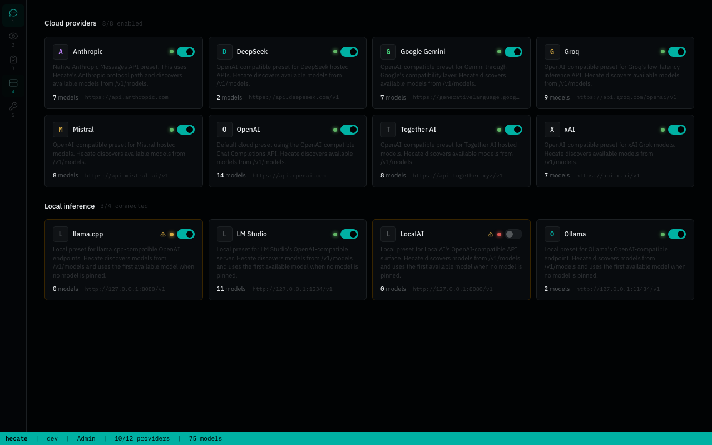

# Providers

Hecate uses a vendor-neutral provider layer at the runtime boundary. It treats OpenAI-compatible upstreams and the Anthropic Messages API as first-class paths — every other supported model lives behind one of those two protocols.



## Providers vs. clients

- **Clients** call Hecate. Codex, Claude Code, OpenAI SDKs, Anthropic SDKs, curl scripts, and internal tools are supported as long as they speak Hecate's OpenAI-compatible or Anthropic-compatible gateway endpoints.
- **Providers** are upstream model backends Hecate calls. In the current alpha, provider management is intentionally limited to the built-in preset catalog below.

This means custom clients are supported today; custom provider create/delete is not a first-class workflow yet.

## Built-in presets

The gateway ships with twelve providers wired up by default. The Providers tab in the operator UI lists all of them; you only need to drop in an API key (cloud) or start the local runtime (local) to enable one.

### Cloud presets

| ID | Name | Default base URL |
|---|---|---|
| `anthropic` | Anthropic | `https://api.anthropic.com/v1` |
| `deepseek` | DeepSeek | `https://api.deepseek.com/v1` |
| `gemini` | Google Gemini | `https://generativelanguage.googleapis.com/v1beta/openai` |
| `groq` | Groq | `https://api.groq.com/openai/v1` |
| `mistral` | Mistral | `https://api.mistral.ai/v1` |
| `openai` | OpenAI | `https://api.openai.com/v1` |
| `together_ai` | Together AI | `https://api.together.xyz/v1` |
| `xai` | xAI | `https://api.x.ai/v1` |

### Local presets

| ID | Name | Default base URL |
|---|---|---|
| `llamacpp` | llama.cpp | `http://127.0.0.1:8080/v1` |
| `lmstudio` | LM Studio | `http://127.0.0.1:1234/v1` |
| `localai` | LocalAI | `http://127.0.0.1:8080/v1` |
| `ollama` | Ollama | `http://127.0.0.1:11434/v1` |

`llamacpp` and `localai` share the same default port — the gateway resolves the conflict automatically by enabling whichever one was configured first; the operator can flip the active one in the Providers tab.

## Configuring a provider

Three approaches, listed from least-to-most production-friendly:

### 1. Environment variables (good for first-run)

Every preset reads three env knobs by lowercased ID:

- `PROVIDER_<NAME>_API_KEY`
- `PROVIDER_<NAME>_BASE_URL` (override the default if you're using a self-hosted proxy)
- `PROVIDER_<NAME>_DEFAULT_MODEL`

Example `.env`:

```bash
PROVIDER_ANTHROPIC_API_KEY=sk-ant-...
PROVIDER_OPENAI_API_KEY=sk-...
PROVIDER_OPENAI_DEFAULT_MODEL=gpt-4o-mini
```

Custom providers are not a first-class launch feature yet. Today, operator-facing provider management is limited to the built-in presets above.

### 2. Operator UI (recommended for ongoing changes)

The Providers tab in the operator UI lists every preset. Click a card to expand its detail panel; paste the API key in. The key is encrypted at rest with `GATEWAY_CONTROL_PLANE_SECRET_KEY` and never leaves the gateway in plaintext after that point. Rotate or revoke from the same panel.

### 3. Control-plane API (for automation)

Every UI action maps to a `PUT /admin/control-plane/providers/{id}/api-key` or `PATCH /admin/control-plane/providers/{id}` call for a built-in preset. The full surface lives in [`internal/api/handler_controlplane.go`](../internal/api/handler_controlplane.go). Useful for terraforming a fleet of gateways from a single config source of truth.

## Health and circuit breaking

Each provider has a per-process health tracker. After a configurable threshold of consecutive retryable failures the breaker opens; the router skips that provider and falls over to the next eligible one. A half-open probe re-opens the breaker after a cooldown. Upstream `429 Too Many Requests` responses cool a provider down immediately so later requests stop hammering a rate-limited backend and can fail over cleanly.

When `GATEWAY_PROVIDER_HEALTH_LATENCY_DEGRADED_THRESHOLD` is set to a positive duration, successful calls that take at-or-above that latency mark the provider `degraded` with health reason `latency` instead of `healthy`. Degraded providers remain routable, but the router scores them behind healthy peers and route diagnostics surface them as `provider_slow` with the last observed latency.

The current snapshot lives at `GET /admin/providers`. A short persisted event history now also lives at `GET /admin/providers/history`, with optional `provider` and `limit` query params. History rows are operator-facing state transitions such as:

- `success`
- `slow_success`
- `failure`
- `cooldown_opened`
- `cooldown_recovered`
- `failover_triggered`
- `failover_selected`

Each row includes the resulting health status, error class, last observed latency, current failure counters, and correlation fields like `request_id` and `trace_id` so operators can answer whether a provider is transiently failing, rate-limited, just getting slow over time, or repeatedly losing traffic during failover.

The history store is configurable with:

- `GATEWAY_PROVIDER_HISTORY_BACKEND` — `memory`, `sqlite`, or `postgres`
- `GATEWAY_PROVIDER_HISTORY_LIMIT` — default page size for `/admin/providers/history`

The Providers tab shows the current state on each card:

- 🟢 **Healthy** — recent successful traffic
- 🟡 **Degraded / half-open** — recent failures, probing for recovery
- 🔴 **Open** — circuit open, requests skip this provider entirely
- ⚪ **Unknown** — no traffic yet to evaluate

Health state is in-process and resets on restart by design — durable health tracking would re-include known-broken upstreams that recovered while the gateway was down.

`GET /admin/providers` is the operator diagnostics surface for provider
readiness. In addition to raw health and discovery fields, each provider
returns:

- `credential_ready` — whether credentials are configured or not required
- `routing_ready` — whether the router can currently send traffic to it
- `routing_blocked_reason` — stable reason when routing is blocked, such as `credential_missing`, `provider_disabled`, `provider_rate_limited`, `circuit_open`, `provider_unhealthy`, or `no_models`
- `model_count`, `discovery_source`, `last_checked_at`, and `last_error` for model-discovery freshness and failure context
- `last_error_class`, `open_until`, `last_latency_ms`, `consecutive_failures`, `timeouts`, `server_errors`, `rate_limits`, `total_successes`, and `total_failures` for richer health debugging

Route reports in the trace inspector reuse the same readiness vocabulary when
they explain why a provider/model candidate was skipped.

## Custom provider status

Custom provider lifecycle is not productized yet: there is no create/delete endpoint and the Providers tab is built around the built-in preset catalog. The next step is a real control-plane custom-provider flow with validation, encrypted credentials, model discovery, and UI management.
