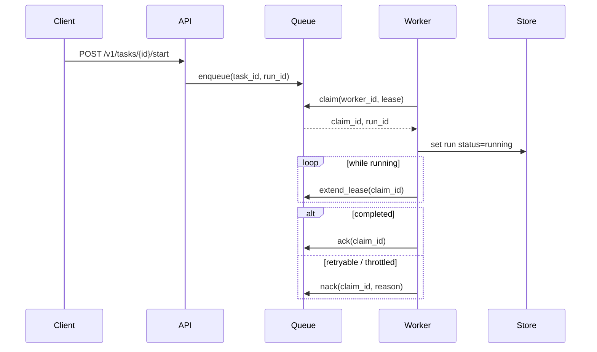

# Runtime API Notes

Hecate exposes a coding-runtime API surface under `/v1/tasks` for client-orchestrated agents. The runtime is durable: a run survives process restarts, can be resumed from a terminal state, and is leased to one worker at a time so two replicas can share a queue without stepping on each other.

For the high-level execution flow (lease semantics, sandbox boundary, event sequence), see [`architecture.md`](architecture.md#task-runtime-flow). For LLM client endpoints (`/v1/chat/completions`, `/v1/messages`, `/v1/models`), see [`client-integration.md`](client-integration.md).

## Core resources

- `task`
- `task_run`
- `task_step`
- `task_artifact`
- `task_approval`
- `task_run_event`

## Lifecycle endpoints

- `POST /v1/tasks`
- `GET /v1/tasks`
- `GET /v1/tasks/{id}`
- `POST /v1/tasks/{id}/start`
- `POST /v1/tasks/{id}/runs/{run_id}/retry`
- `POST /v1/tasks/{id}/runs/{run_id}/resume`
- `POST /v1/tasks/{id}/runs/{run_id}/cancel`

Resume semantics:

- resume is allowed when the source run is terminal (`failed` or `cancelled`)
- resume creates a new run attempt (new `run_id`) rather than mutating the original run
- the new run reuses the prior run workspace when available, so file state carries forward
- optional payload: `{"reason":"..."}` to annotate the resume request
- resumed executions include checkpoint context (source run id, last completed step, last event sequence) in step input so executors/tools can continue from the prior boundary

## Execution detail endpoints

- `GET /v1/tasks/{id}/runs`
- `GET /v1/tasks/{id}/runs/{run_id}`
- `GET /v1/tasks/{id}/runs/{run_id}/steps`
- `GET /v1/tasks/{id}/runs/{run_id}/steps/{step_id}`
- `GET /v1/tasks/{id}/runs/{run_id}/artifacts`
- `GET /v1/tasks/{id}/runs/{run_id}/artifacts/{artifact_id}`
- `GET /v1/tasks/{id}/artifacts`

## Approval endpoints

- `GET /v1/tasks/{id}/approvals`
- `GET /v1/tasks/{id}/approvals/{approval_id}`
- `POST /v1/tasks/{id}/approvals/{approval_id}/resolve`

## Event and stream endpoints

- `GET /v1/tasks/{id}/runs/{run_id}/events?after_sequence=<n>`
- `POST /v1/tasks/{id}/runs/{run_id}/events`
- `GET /v1/tasks/{id}/runs/{run_id}/stream?after_sequence=<n>`

Stream resume also supports `Last-Event-ID`.

## Queue execution model

When a run is queued, workers consume it through a claim/lease protocol:

1. enqueue `task_id` + `run_id`
2. worker claims with a time-bound lease
3. worker heartbeats to extend lease while work is running
4. worker `ack`s on success/terminal handling or `nack`s to requeue
5. expired leases can be reclaimed by another worker

## Runtime backend and queue configuration

- `GATEWAY_TASKS_BACKEND=memory|postgres`
- `GATEWAY_TASK_APPROVAL_POLICIES=shell_exec,git_exec,file_write,network_egress`
- `GATEWAY_TASK_QUEUE_BACKEND=memory|postgres`
- `GATEWAY_TASK_QUEUE_WORKERS=<int>`
- `GATEWAY_TASK_QUEUE_BUFFER=<int>`
- `GATEWAY_TASK_QUEUE_LEASE_SECONDS=<int>`
- `GATEWAY_TASK_MAX_CONCURRENT_PER_TENANT=<int>` (`0` disables the limit)

When `GATEWAY_TASKS_BACKEND=postgres`, tasks/runs/steps/approvals/artifacts/run-events are persisted and the stream replay cursor is durable across restarts. When `GATEWAY_TASK_QUEUE_BACKEND=postgres`, workers claim queue items with renewable leases, so pending runs survive process restarts and can be recovered by another worker when a lease expires.

`GET /admin/runtime/stats` also reports queue health fields including queue depth, queue capacity, worker count, and `queue_backend`.
